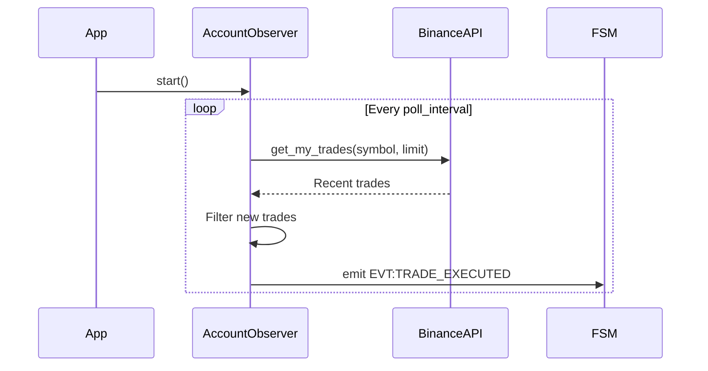

# –ê—Ä—Ö—ñ—Ç–µ–∫—Ç—É—Ä–Ω–∞ — —Ö–µ–º–∞ –¥–æ–º–µ–Ω—É Account Observer

## –ó–∞–≥–∞–ª—å–Ω–∞ –∞—Ä—Ö—ñ—Ç–µ–∫—Ç—É—Ä–∞

–î–æ–º–µ–Ω `account_observer` —Ä–µ–∞–ª—ñ–∑—É—î –ø–∞—Ç—Ç–µ—Ä–Ω **Observer** –¥–ª—è –ø–∞— –∏–≤–Ω–æ–≥–æ –º–æ–Ω—ñ—Ç–æ—Ä–∏–Ω–≥—É —Ç–æ—Ä–≥–æ–≤–æ—ó –∞–∫—Ç–∏–≤–Ω–æ— —Ç—ñ –Ω–∞ Binance Futures. –ê—Ä—Ö—ñ—Ç–µ–∫—Ç—É—Ä–∞ –ø–æ–±—É–¥–æ–≤–∞–Ω–∞ –Ω–∞ –ø—Ä–∏–Ω—Ü–∏–ø–∞—Ö –Ω–∞–¥—ñ–π–Ω–æ— —Ç—ñ, –¥–µ–¥—É–ø–ª—ñ–∫–∞—Ü—ñ—ó —Ç–∞ –∞— –∏–Ω—Ö—Ä–æ–Ω–Ω–æ—ó –æ–±—Ä–æ–±–∫–∏.

```
┌─────────────────┐    ┌──────────────────┐    ┌─────────────────┐
│   Binance API   │◄──►│  AccountObserver │◄──►│   FSM Events    │
│   (Read-Only)   │    │   (Core Logic)   │    │   (Internal)    │
└─────────────────┘    └──────────────────┘    └─────────────────┘
                              │
                              ▼
                       ┌──────────────────┐
                       │  Deduplication   │
                       │   & Caching      │
                       └──────────────────┘
```

## –ö–æ–º–ø–æ–Ω–µ–Ω—Ç–∏ –∞—Ä—Ö—ñ—Ç–µ–∫—Ç—É—Ä–∏

### 1. AccountObserver (–ì–æ–ª–æ–≤–Ω–∏–π –∫–ª–∞— )

**–í—ñ–¥–ø–æ–≤—ñ–¥–∞–ª—å–Ω—ñ— —Ç—å:**
- –£–ø—Ä–∞–≤–ª—ñ–Ω–Ω—è –∂–∏—Ç—Ç—î–≤–∏–º —Ü–∏–∫–ª–æ–º –¥–æ–º–µ–Ω—É
- –ö–æ–æ—Ä–¥–∏–Ω–∞—Ü—ñ—è API –≤–∏–∫–ª–∏–∫—ñ–≤ –¥–ª—è –º–æ–Ω—ñ—Ç–æ—Ä–∏–Ω–≥—É —Ç—Ä–µ–π–¥—ñ–≤
- –î–µ–¥—É–ø–ª—ñ–∫–∞—Ü—ñ—è –æ–±—Ä–æ–±–ª–µ–Ω–∏—Ö —Ç—Ä–µ–π–¥—ñ–≤
- –ï–º—ñ— —ñ—è –ø–æ–¥—ñ–π –ø—Ä–æ –Ω–æ–≤—ñ —Ç–æ—Ä–≥–æ–≤—ñ –æ–ø–µ—Ä–∞—Ü—ñ—ó

**–ö–ª—é—á–æ–≤—ñ –º–µ—Ç–æ–¥–∏:**
- `__init__()` - –Ü–Ω—ñ—Ü—ñ–∞–ª—ñ–∑–∞—Ü—ñ—è –∑ –∫–æ–Ω—Ñ—ñ–≥—É—Ä–∞—Ü—ñ—î—é —Ç–∞ Binance –∫–ª—ñ—î–Ω—Ç–æ–º
- `start()` - –ó–∞–ø—É— –∫ —Ñ–æ–Ω–æ–≤–æ–≥–æ –º–æ–Ω—ñ—Ç–æ—Ä–∏–Ω–≥—É
- `stop()` - Graceful shutdown
- `_poll_loop()` - –û— –Ω–æ–≤–Ω–∏–π —Ü–∏–∫–ª –æ–ø–∏—Ç—É–≤–∞–Ω–Ω—è
- `_poll_trades()` - –û—Ç—Ä–∏–º–∞–Ω–Ω—è —Ç—Ä–µ–π–¥—ñ–≤ –∑ API
- `_process_trades()` - –û–±—Ä–æ–±–∫–∞ —Ç–∞ —Ñ—ñ–ª—å—Ç—Ä–∞—Ü—ñ—è —Ç—Ä–µ–π–¥—ñ–≤
- `_trade_to_payload()` - –ö–æ–Ω–≤–µ—Ä—Ç–∞—Ü—ñ—è –≤ payload –ø–æ–¥—ñ—ó

### 2. Binance Client (–ó–æ–≤–Ω—ñ—à–Ω—è –∑–∞–ª–µ–∂–Ω—ñ— —Ç—å)

**–†–æ–ª—å:** –ö–ª—ñ—î–Ω—Ç –¥–ª—è –≤–∑–∞—î–º–æ–¥—ñ—ó –∑ Binance Futures API (read-only)

**–í–∏–∫–æ—Ä–∏— —Ç–æ–≤—É–≤–∞–Ω—ñ –º–µ—Ç–æ–¥–∏:**
- `get_my_trades(symbol, limit)` - –û—Ç—Ä–∏–º–∞–Ω–Ω—è –æ— —Ç–∞–Ω–Ω—ñ—Ö —Ç—Ä–µ–π–¥—ñ–≤ –¥–ª—è — –∏–º–≤–æ–ª—É

### 3. Deduplication System (–í–Ω—É—Ç—Ä—ñ—à–Ω—è –ª–æ–≥—ñ–∫–∞)

**–ú–µ—Ö–∞–Ω—ñ–∑–º –¥–µ–¥—É–ø–ª—ñ–∫–∞—Ü—ñ—ó:**
- `processed_trade_ids: Set[int]` - –º–Ω–æ–∂–∏–Ω–∞ –æ–±—Ä–æ–±–ª–µ–Ω–∏—Ö ID —Ç—Ä–µ–π–¥—ñ–≤
- –ü–µ—Ä–µ–≤—ñ—Ä–∫–∞ –Ω–∞—è–≤–Ω–æ— —Ç—ñ trade_id –ø–µ—Ä–µ–¥ –æ–±—Ä–æ–±–∫–æ—é
- –î–æ–¥–∞–≤–∞–Ω–Ω—è –≤ –º–Ω–æ–∂–∏–Ω—É –ø—ñ— –ª—è —É— –ø—ñ—à–Ω–æ—ó –æ–±—Ä–æ–±–∫–∏

## –†–æ–±–æ—á—ñ –ø—Ä–æ—Ü–µ— –∏

### –ü—Ä–æ—Ü–µ—  —ñ–Ω—ñ—Ü—ñ–∞–ª—ñ–∑–∞—Ü—ñ—ó



### –û— –Ω–æ–≤–Ω–∏–π —Ü–∏–∫–ª –º–æ–Ω—ñ—Ç–æ—Ä–∏–Ω–≥—É



### –û–±—Ä–æ–±–∫–∞ –æ–∫—Ä–µ–º–æ–≥–æ —Ç—Ä–µ–π–¥—É



## –°—Ç—Ä—É–∫—Ç—É—Ä–∏ –¥–∞–Ω–∏—Ö

### Trade Data Structure (–≤—ñ–¥ Binance API)
```python
@dataclass
class BinanceTrade:
    symbol: str          # –¢–æ—Ä–≥–æ–≤–∞ –ø–∞—Ä–∞
    id: int             # –£–Ω—ñ–∫–∞–ª—å–Ω–∏–π ID —Ç—Ä–µ–π–¥—É
    orderId: int        # ID –æ—Ä–¥–µ—Ä–∞
    price: str          # –¶—ñ–Ω–∞ –≤–∏–∫–æ–Ω–∞–Ω–Ω—è
    qty: str            # –ö—ñ–ª—å–∫—ñ— —Ç—å
    quoteQty: str       # –ó–∞–≥–∞–ª—å–Ω–∞ –≤–∞—Ä—Ç—ñ— —Ç—å
    commission: str     # –ö–æ–º—ñ— —ñ—è
    commissionAsset: str # –ê–∫—Ç–∏–≤ –∫–æ–º—ñ— —ñ—ó
    time: int           # –ß–∞—  –≤–∏–∫–æ–Ω–∞–Ω–Ω—è (ms)
    isBuyer: bool       # –ù–∞–ø—Ä—è–º–æ–∫ (–∫—É–ø—ñ–≤–ª—è/–ø—Ä–æ–¥–∞–∂)
    isMaker: bool       # Maker/Taker
    isBestMatch: bool   # –ù–∞–π–∫—Ä–∞—â–µ — –ø—ñ–≤–ø–∞–¥–∞–Ω–Ω—è
```

### Event Payload Structure
```python
@dataclass
class TradeExecutedPayload:
    symbol: str         # –¢–æ—Ä–≥–æ–≤–∞ –ø–∞—Ä–∞
    side: str          # 'buy' –∞–±–æ 'sell'
    price: str         # –¶—ñ–Ω–∞ —è–∫ —Ä—è–¥–æ–∫ –¥–ª—è —Ç–æ—á–Ω–æ— —Ç—ñ
    quantity: str      # –ö—ñ–ª—å–∫—ñ— —Ç—å (–≤—ñ–¥'—î–º–Ω–∞ –¥–ª—è –ø—Ä–æ–¥–∞–∂—É)
    ts: int            # Timestamp –≤ –º—ñ–ª—ñ— –µ–∫—É–Ω–¥–∞—Ö
    fees: str          # –ö–æ–º—ñ— —ñ—è —è–∫ —Ä—è–¥–æ–∫
    venue: str         # 'binance'
```

## –ö–æ–Ω—Ñ—ñ–≥—É—Ä–∞—Ü—ñ—è —Ç–∞ –ø–∞—Ä–∞–º–µ—Ç—Ä–∏

### –†–µ–∂–∏–º–∏ —Ä–æ–±–æ—Ç–∏

#### Live Mode
```
–ö–æ–Ω—Ñ—ñ–≥—É—Ä–∞—Ü—ñ—è: trading_mode = "live"
API: Binance Live (mainnet)
–ö–ª—é—á—ñ: BINANCE_LIVE_API_KEY/SECRET
–°–∏–º–≤–æ–ª–∏: –†–µ–∞–ª—å–Ω—ñ —Ç–æ—Ä–≥–æ–≤—ñ –ø–∞—Ä–∏
```

#### Testnet Mode
```
–ö–æ–Ω—Ñ—ñ–≥—É—Ä–∞—Ü—ñ—è: trading_mode = "testnet"
API: Binance Testnet
–ö–ª—é—á—ñ: BINANCE_TESTNET_API_KEY/SECRET
–°–∏–º–≤–æ–ª–∏: –¢–µ— —Ç–æ–≤—ñ —Ç–æ—Ä–≥–æ–≤—ñ –ø–∞—Ä–∏
```

#### Hybrid Mode
```
–ö–æ–Ω—Ñ—ñ–≥—É—Ä–∞—Ü—ñ—è: trading_mode = "hybrid_*"
–ê–≤—Ç–æ–º–∞—Ç–∏—á–Ω–∏–π –≤–∏–±—ñ—Ä –∑–∞–ª–µ–∂–Ω–æ –≤—ñ–¥ –∫–æ–Ω—Ç–µ–∫— —Ç—É
```

### –ü–∞—Ä–∞–º–µ—Ç—Ä–∏ –º–æ–Ω—ñ—Ç–æ—Ä–∏–Ω–≥—É

```yaml
account_observer:
  poll_interval: 5        # –Ü–Ω—Ç–µ—Ä–≤–∞–ª –æ–ø–∏—Ç—É–≤–∞–Ω–Ω—è (— –µ–∫—É–Ω–¥–∏)
  symbols:                # –°–ø–∏— –æ–∫ — –∏–º–≤–æ–ª—ñ–≤ –¥–ª—è –º–æ–Ω—ñ—Ç–æ—Ä–∏–Ω–≥—É
    - BTCUSDT
    - ETHUSDT
    - BNBUSDT
  trade_limit: 50        # –ö—ñ–ª—å–∫—ñ— —Ç—å —Ç—Ä–µ–π–¥—ñ–≤ –¥–ª—è –æ—Ç—Ä–∏–º–∞–Ω–Ω—è –∑–∞ —Ä–∞–∑
```

## –ü—Ä–æ–¥—É–∫—Ç–∏–≤–Ω—ñ— —Ç—å —Ç–∞ SLA

### –¶—ñ–ª—å–æ–≤—ñ –º–µ—Ç—Ä–∏–∫–∏
- **–°–≤—ñ–∂—ñ— —Ç—å –¥–∞–Ω–∏—Ö:** < 35 — –µ–∫—É–Ω–¥ (poll_interval + –æ–±—Ä–æ–±–∫–∞)
- **–î–µ–¥—É–ø–ª—ñ–∫–∞—Ü—ñ—è:** 100% (–∂–æ–¥–Ω–∏—Ö –¥—É–±–ª—ñ–∫–∞—Ç—ñ–≤ –ø–æ–¥—ñ–π)
- **–î–æ— —Ç—É–ø–Ω—ñ— —Ç—å:** 99.5% (–¥–æ–ø—É— —Ç–∏–º—ñ 3.65 –≥–æ–¥–∏–Ω–∏ –ø—Ä–æ— —Ç–æ—é –Ω–∞ –º—ñ— —è—Ü—å)
- **–ß–∞—  –≤—ñ–¥–ø–æ–≤—ñ–¥—ñ API:** < 5 — –µ–∫—É–Ω–¥ median

### –ú–æ–Ω—ñ—Ç–æ—Ä–∏–Ω–≥ –ø—Ä–æ–¥—É–∫—Ç–∏–≤–Ω–æ— —Ç—ñ
- –ö—ñ–ª—å–∫—ñ— —Ç—å –æ–ø–∏—Ç—É–≤–∞–Ω—å –∑–∞ —Ö–≤–∏–ª–∏–Ω—É
- –†–æ–∑–º—ñ—Ä –≤—ñ–¥–ø–æ–≤—ñ–¥–µ–π API
- –ß–∞—  –æ–±—Ä–æ–±–∫–∏ —Ç—Ä–µ–π–¥—ñ–≤
- –í–∏–∫–æ—Ä–∏— —Ç–∞–Ω–Ω—è –ø–∞–º'—è—Ç—ñ –¥–ª—è –∫–µ—à—É ID

## –ë–µ–∑–ø–µ–∫–∞ —Ç–∞ –Ω–∞–¥—ñ–π–Ω—ñ— —Ç—å

### –ó–∞—Ö–∏— —Ç –¥–∞–Ω–∏—Ö
- **Read-only –∫–ª—é—á—ñ:** –¢—ñ–ª—å–∫–∏ –¥–ª—è —á–∏—Ç–∞–Ω–Ω—è, –±–µ–∑ –º–æ–∂–ª–∏–≤–æ— —Ç—ñ —Ç–æ—Ä–≥—ñ–≤–ª—ñ
- **–ú—ñ–Ω—ñ–º–∞–ª—å–Ω—ñ –¥–æ–∑–≤–æ–ª–∏:** –î–æ— —Ç—É–ø —Ç—ñ–ª—å–∫–∏ –¥–æ –≤–ª–∞— –Ω–∏—Ö —Ç—Ä–µ–π–¥—ñ–≤
- **HTTPS:** –í— —ñ API –≤–∏–∫–ª–∏–∫–∏ —á–µ—Ä–µ–∑ –∑–∞—Ö–∏—â–µ–Ω–∏–π –ø—Ä–æ—Ç–æ–∫–æ–ª

### –°—Ç—Ä–∞—Ç–µ–≥—ñ—ó –≤—ñ–¥–Ω–æ–≤–ª–µ–Ω–Ω—è
1. **API –ø–æ–º–∏–ª–∫–∏:** –ü—Ä–æ–¥–æ–≤–∂–µ–Ω–Ω—è –∑ —ñ–Ω—à–∏–º–∏ — –∏–º–≤–æ–ª–∞–º–∏
2. **–ú–µ—Ä–µ–∂–µ–≤—ñ –ø—Ä–æ–±–ª–µ–º–∏:** –ü–æ–≤—Ç–æ—Ä –ø—Ä–∏ –Ω–∞— —Ç—É–ø–Ω–æ–º—É —Ü–∏–∫–ª—ñ
3. **–ü–∞—Ä— –∏–Ω–≥ –ø–æ–º–∏–ª–∫–∏:** –õ–æ–≥—É–≤–∞–Ω–Ω—è —Ç–∞ –ø—Ä–æ–ø—É— –∫ –ø—Ä–æ–±–ª–µ–º–Ω–∏—Ö —Ç—Ä–µ–π–¥—ñ–≤
4. **Memory leaks:** –û–±–º–µ–∂–µ–Ω–Ω—è —Ä–æ–∑–º—ñ—Ä—É –∫–µ—à—É processed_trade_ids

## –¢–µ— —Ç—É–≤–∞–Ω–Ω—è –∞—Ä—Ö—ñ—Ç–µ–∫—Ç—É—Ä–∏

### –Ü–Ω—Ç–µ–≥—Ä–∞—Ü—ñ–π–Ω—ñ —Ç–µ— —Ç–∏
- **API Integration:** –ú–æ–∫—É–≤–∞–Ω–Ω—è Binance API –¥–ª—è —Ç–µ— —Ç—É–≤–∞–Ω–Ω—è –æ—Ç—Ä–∏–º–∞–Ω–Ω—è —Ç—Ä–µ–π–¥—ñ–≤
- **FSM Integration:** –í–∞–ª—ñ–¥–∞—Ü—ñ—è –µ–º—ñ— —ñ—ó –ø–æ–¥—ñ–π —Ç–∞ —ó—Ö — –ø–æ–∂–∏–≤–∞–Ω–Ω—è
- **Deduplication:** –¢–µ— —Ç—É–≤–∞–Ω–Ω—è –ª–æ–≥—ñ–∫–∏ —É–Ω–∏–∫–Ω–µ–Ω–Ω—è –¥—É–±–ª—ñ–∫–∞—Ç—ñ–≤

### Performance Testing
- **Load Testing:** –°–∏–º—É–ª—è—Ü—ñ—è –≤–µ–ª–∏–∫–æ—ó –∫—ñ–ª—å–∫–æ— —Ç—ñ —Ç—Ä–µ–π–¥—ñ–≤
- **Memory Testing:** –ü–µ—Ä–µ–≤—ñ—Ä–∫–∞ –≤–∏—Ç—ñ–∫—ñ–≤ –ø–∞–º'—è—Ç—ñ –ø—Ä–∏ –¥–æ–≤–≥–æ—Ç—Ä–∏–≤–∞–ª—ñ–π —Ä–æ–±–æ—Ç—ñ
- **Concurrency Testing:** –ü–µ—Ä–µ–≤—ñ—Ä–∫–∞ –ø–æ—Ç–æ–∫–æ–±–µ–∑–ø–µ—á–Ω–æ— —Ç—ñ

## –†–æ–∑—à–∏—Ä–µ–Ω–Ω—è —Ç–∞ –µ–≤–æ–ª—é—Ü—ñ—è

### –ú–æ–∂–ª–∏–≤—ñ –ø–æ–∫—Ä–∞—â–µ–Ω–Ω—è
- **WebSocket Integration:** –ü–µ—Ä–µ—Ö—ñ–¥ –∑ polling –Ω–∞ real-time updates
- **Multi-Exchange Support:** –ü—ñ–¥—Ç—Ä–∏–º–∫–∞ —ñ–Ω—à–∏—Ö –±—ñ—Ä–∂
- **Advanced Filtering:** –§—ñ–ª—å—Ç—Ä–∞—Ü—ñ—è —Ç—Ä–µ–π–¥—ñ–≤ –∑–∞ —á–∞— –æ–º, — –∏–º–≤–æ–ª–æ–º, —Ä–æ–∑–º—ñ—Ä–æ–º
- **Batch Processing:** –ì—Ä—É–ø–æ–≤–∞ –æ–±—Ä–æ–±–∫–∞ —Ç—Ä–µ–π–¥—ñ–≤ –¥–ª—è –æ–ø—Ç–∏–º—ñ–∑–∞—Ü—ñ—ó

### –ú—ñ–≥—Ä–∞—Ü—ñ–π–Ω—ñ — —Ç—Ä–∞—Ç–µ–≥—ñ—ó
- **Gradual Rollout:** –ü–æ— —Ç—ñ–π–Ω–µ —Ä–æ–∑–≥–æ—Ä—Ç–∞–Ω–Ω—è –∑ –º–æ–Ω—ñ—Ç–æ—Ä–∏–Ω–≥–æ–º –¥–µ–¥—É–ø–ª—ñ–∫–∞—Ü—ñ—ó
- **A/B Testing:** –ü–æ—Ä—ñ–≤–Ω—è–Ω–Ω—è — —Ç–∞—Ä–∏—Ö —Ç–∞ –Ω–æ–≤–∏—Ö –≤–µ—Ä— —ñ–π
- **Feature Flags:** –í–∫–ª—é—á–µ–Ω–Ω—è –Ω–æ–≤–∏—Ö —Ñ—É–Ω–∫—Ü—ñ–π —á–µ—Ä–µ–∑ –∫–æ–Ω—Ñ—ñ–≥—É—Ä–∞—Ü—ñ—é

## –î—ñ–∞–≥—Ä–∞–º–∏ –ø–æ— –ª—ñ–¥–æ–≤–Ω–æ— —Ç—ñ

### –ù–æ—Ä–º–∞–ª—å–Ω–∏–π –ø–æ—Ç—ñ–∫ —Ä–æ–±–æ—Ç–∏


### –ü–æ—Ç—ñ–∫ –æ–±—Ä–æ–±–∫–∏ –¥—É–±–ª—ñ–∫–∞—Ç—ñ–≤
```mermaid
sequenceDiagram
    participant AccountObserver
    participant Cache
    participant FSM

    AccountObserver->>Cache: Check trade_id
    Cache-->>AccountObserver: Not processed
    AccountObserver->>Cache: Add trade_id
    AccountObserver->>FSM: emit EVT:TRADE_EXECUTED
    Note over Cache: Trade marked as processed
```</content>
<parameter name="filePath">c:\Users\job11\Music\Olimp_v1\docs\domains\account_observer\architecture.md