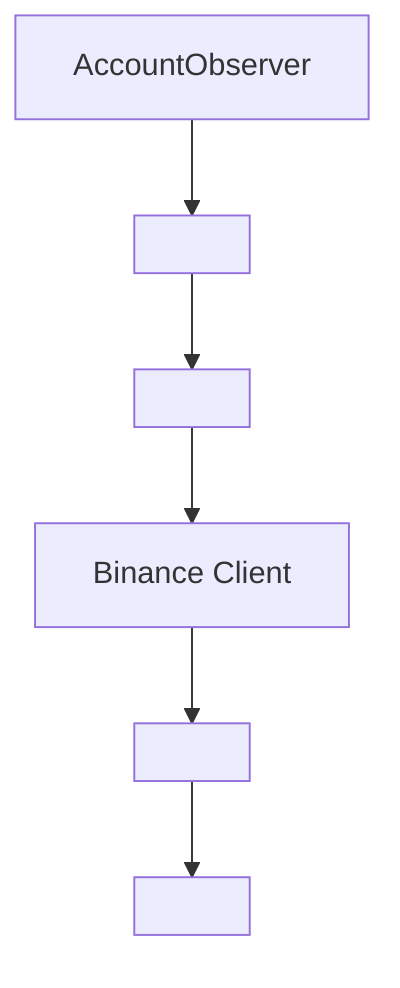
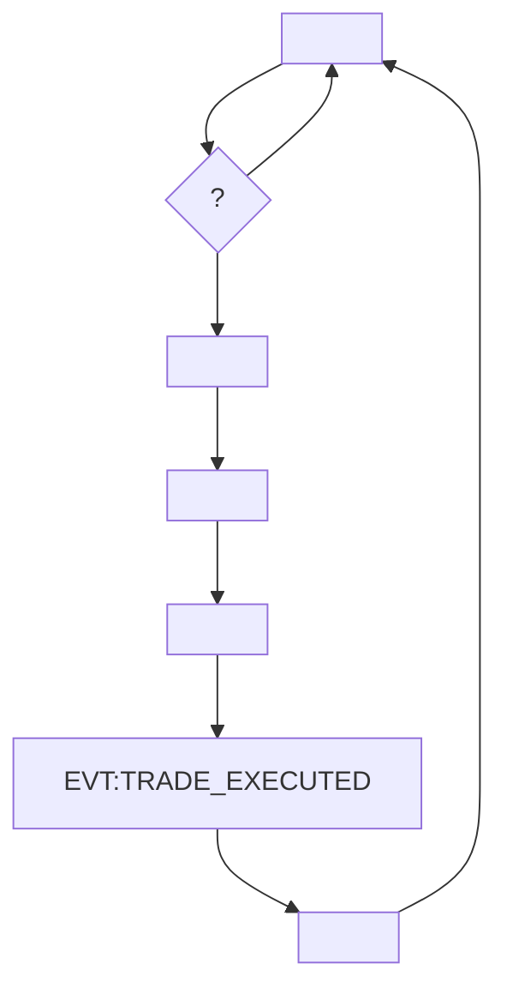
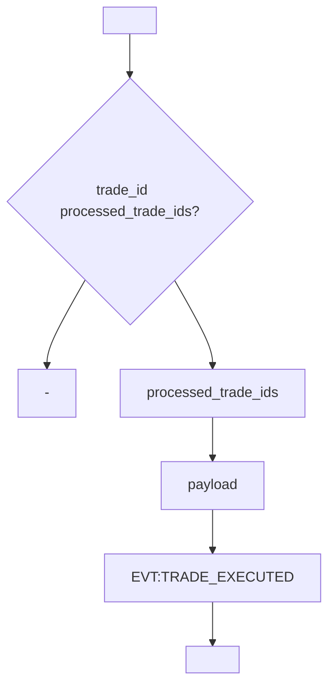
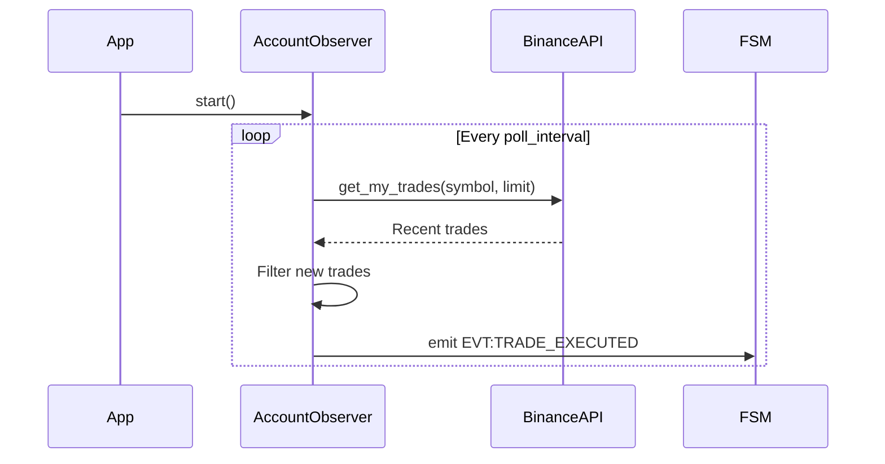

#                                                  Account Observer

##                                        

           `account_observer`                                 **Observer**                                                                                             Binance Futures.                                                                                         ,                                                                    .

```
                                                                                                                                                                                      
      Binance API                       AccountObserver                      FSM Events       
      (Read-Only)                (Core Logic)                (Internal)       
                                                                                                                                                                                      
                                 
                                 
                                                                                   
                            Deduplication      
                             & Caching         
                                                                                   
```

##                                            

### 1. AccountObserver (                         )

**                                :**
-                                                                
-                        API                                                              
-                                                             
-                                                                        

**                           :**
- `__init__()` -                                                               Binance                 
- `start()` -                                                     
- `stop()` - Graceful shutdown
- `_poll_loop()` -                                               
- `_poll_trades()` -                                      API
- `_process_trades()` -                                                        
- `_trade_to_payload()` -                           payload           

### 2. Binance Client (                                     )

**        :**                                           Binance Futures API (read-only)

**                                           :**
- `get_my_trades(symbol, limit)` -                                                                         

### 3. Deduplication System (                               )

**                                         :**
- `processed_trade_ids: Set[int]` -                                     ID               
-                                       trade_id                            
-                                                                                

##                            

###                                        



###                                                 



###                                             



##                              

### Trade Data Structure (       Binance API)
```python
@dataclass
class BinanceTrade:
    symbol: str          #                        
    id: int             #                      ID             
    orderId: int        # ID             
    price: str          #                            
    qty: str            #                   
    quoteQty: str       #                                  
    commission: str     #               
    commissionAsset: str #                          
    time: int           #                           (ms)
    isBuyer: bool       #                  (              /            )
    isMaker: bool       # Maker/Taker
    isBestMatch: bool   #                                        
```

### Event Payload Structure
```python
@dataclass
class TradeExecutedPayload:
    symbol: str         #                        
    side: str          # 'buy'        'sell'
    price: str         #                                                 
    quantity: str      #                    (      '                              )
    ts: int            # Timestamp                            
    fees: str          #                               
    venue: str         # 'binance'
```

##                                                 

###                          

#### Live Mode
```
                        : trading_mode = "live"
API: Binance Live (mainnet)
          : BINANCE_LIVE_API_KEY/SECRET
              :                                       
```

#### Testnet Mode
```
                        : trading_mode = "testnet"
API: Binance Testnet
          : BINANCE_TESTNET_API_KEY/SECRET
              :                                       
```

#### Hybrid Mode
```
                        : trading_mode = "hybrid_*"
                                                                            
```

###                                          

```yaml
account_observer:
  poll_interval: 5        #                                       (              )
  symbols:                #                                                            
    - BTCUSDT
    - ETHUSDT
    - BNBUSDT
  trade_limit: 50        #                                                                        
```

##                                   SLA

###                              
- **                           :** < 35              (poll_interval +               )
- **                        :** 100% (                                            )
- **                      :** 99.5% (                   3.65                                              )
- **                          API:** < 5              median

###                                                  
-                                                          
-                                   API
-                                     
-                                '                       ID

##                                         

###                        
- **Read-only           :**                                   ,                                             
- **                                   :**                                                             
- **HTTPS:**        API                                                              

###                                          
1. **API               :**                                                          
2. **                                 :**                                                    
3. **                             :**                                                                           
4. **Memory leaks:**                                            processed_trade_ids

##                                            

###                                    
- **API Integration:**                    Binance API                                                              
- **FSM Integration:**                                                                          
- **Deduplication:**                                                                          

### Performance Testing
- **Load Testing:**                                                                    
- **Memory Testing:**                                         '                                                     
- **Concurrency Testing:**                                                      

##                                           

###                                    
- **WebSocket Integration:**                   polling      real-time updates
- **Multi-Exchange Support:**                                       
- **Advanced Filtering:**                                                    ,                 ,                 
- **Batch Processing:**                                                                           

###                                        
- **Gradual Rollout:**                                                                                             
- **A/B Testing:**                                                               
- **Feature Flags:**                                                                                 

##                                            

###                                             


###                                               
```mermaid
sequenceDiagram
    participant AccountObserver
    participant Cache
    participant FSM

    AccountObserver->>Cache: Check trade_id
    Cache-->>AccountObserver: Not processed
    AccountObserver->>Cache: Add trade_id
    AccountObserver->>FSM: emit EVT:TRADE_EXECUTED
    Note over Cache: Trade marked as processed
```</content>
<parameter name="filePath">c:\Users\job11\Music\Olimp_v1\docs\domains\account_observer\architecture.md