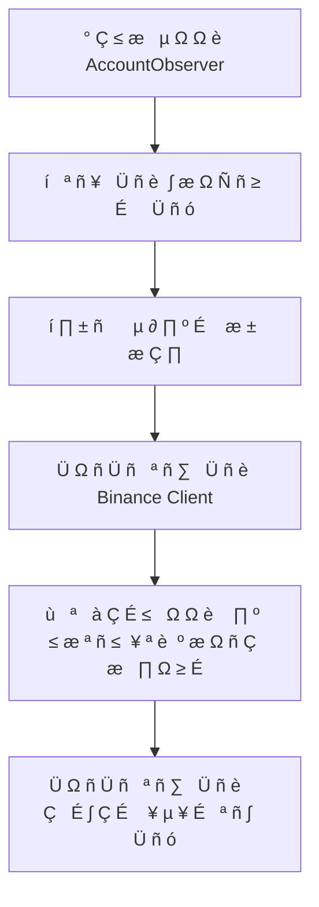
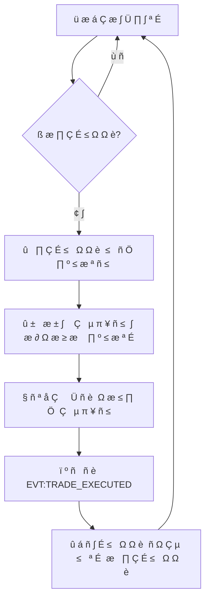
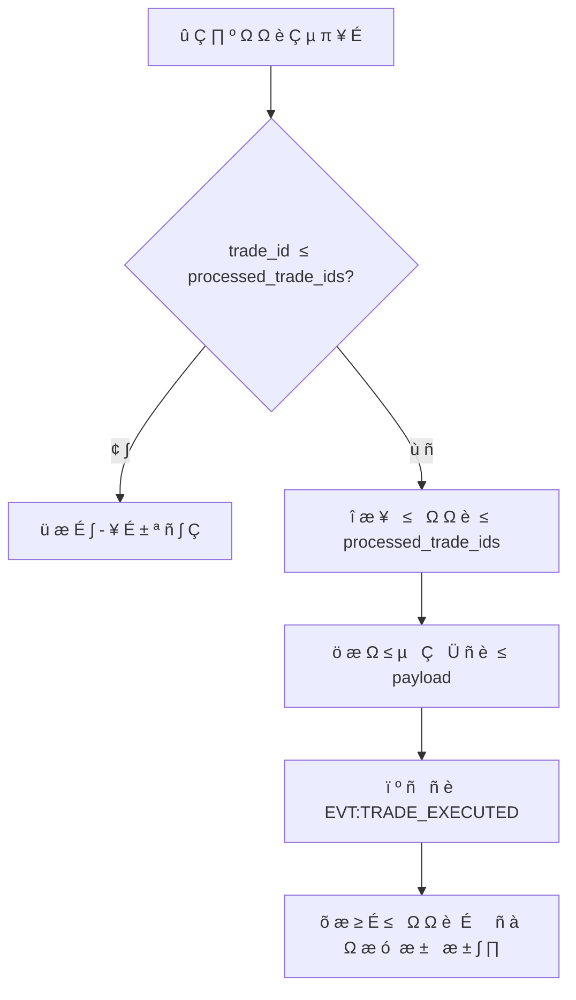
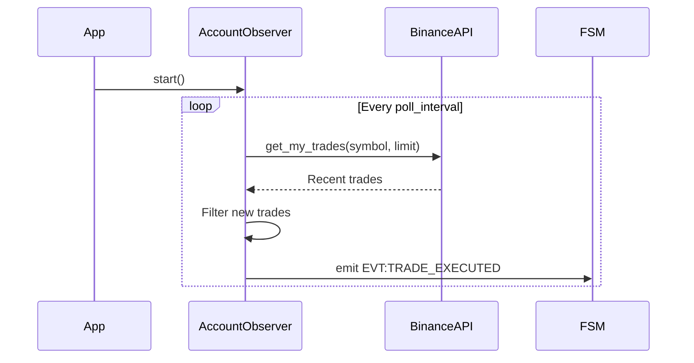

#  ê   Ö ñ Ç µ ∫ Ç É   Ω      Ö µ º    ¥ æ º µ Ω É Account Observer

##  ó   ≥   ª å Ω        Ö ñ Ç µ ∫ Ç É    

 î æ º µ Ω `account_observer`    µ   ª ñ ∑ É î      Ç Ç µ   Ω **Observer**  ¥ ª è        ∏ ≤ Ω æ ≥ æ  º æ Ω ñ Ç æ   ∏ Ω ≥ É  Ç æ   ≥ æ ≤ æ ó    ∫ Ç ∏ ≤ Ω æ   Ç ñ  Ω   Binance Futures.  ê   Ö ñ Ç µ ∫ Ç É        æ ± É ¥ æ ≤   Ω    Ω        ∏ Ω Ü ∏     Ö  Ω   ¥ ñ π Ω æ   Ç ñ,  ¥ µ ¥ É   ª ñ ∫   Ü ñ ó  Ç        ∏ Ω Ö   æ Ω Ω æ ó  æ ±   æ ± ∫ ∏.

```
‚îå‚î ‚î ‚î ‚î ‚î ‚î ‚î ‚î ‚î ‚î ‚î ‚î ‚î ‚î ‚î ‚î ‚î ‚îê    ‚îå‚î ‚î ‚î ‚î ‚î ‚î ‚î ‚î ‚î ‚î ‚î ‚î ‚î ‚î ‚î ‚î ‚î ‚î ‚îê    ‚îå‚î ‚î ‚î ‚î ‚î ‚î ‚î ‚î ‚î ‚î ‚î ‚î ‚î ‚î ‚î ‚î ‚î ‚îê
│   Binance API   │◄┠┠►│  AccountObserver │◄┠┠►│   FSM Events    │
│   (Read-Only)   │    │   (Core Logic)   │    │   (Internal)    │
‚îî‚î ‚î ‚î ‚î ‚î ‚î ‚î ‚î ‚î ‚î ‚î ‚î ‚î ‚î ‚î ‚î ‚î ‚îò    ‚îî‚î ‚î ‚î ‚î ‚î ‚î ‚î ‚î ‚î ‚î ‚î ‚î ‚î ‚î ‚î ‚î ‚î ‚î ‚îò    ‚îî‚î ‚î ‚î ‚î ‚î ‚î ‚î ‚î ‚î ‚î ‚î ‚î ‚î ‚î ‚î ‚î ‚î ‚îò
                              │
                              ▼
                       ‚îå‚î ‚î ‚î ‚î ‚î ‚î ‚î ‚î ‚î ‚î ‚î ‚î ‚î ‚î ‚î ‚î ‚î ‚î ‚îê
                       │  Deduplication   │
                       │   & Caching      │
                       ‚îî‚î ‚î ‚î ‚î ‚î ‚î ‚î ‚î ‚î ‚î ‚î ‚î ‚î ‚î ‚î ‚î ‚î ‚î ‚îò
```

##  ö æ º   æ Ω µ Ω Ç ∏      Ö ñ Ç µ ∫ Ç É   ∏

### 1. AccountObserver ( ì æ ª æ ≤ Ω ∏ π  ∫ ª    )

** í ñ ¥   æ ≤ ñ ¥   ª å Ω ñ   Ç å:**
-  £       ≤ ª ñ Ω Ω è  ∂ ∏ Ç Ç î ≤ ∏ º  Ü ∏ ∫ ª æ º  ¥ æ º µ Ω É
-  ö æ æ   ¥ ∏ Ω   Ü ñ è API  ≤ ∏ ∫ ª ∏ ∫ ñ ≤  ¥ ª è  º æ Ω ñ Ç æ   ∏ Ω ≥ É  Ç   µ π ¥ ñ ≤
-  î µ ¥ É   ª ñ ∫   Ü ñ è  æ ±   æ ± ª µ Ω ∏ Ö  Ç   µ π ¥ ñ ≤
-  ï º ñ   ñ è    æ ¥ ñ π      æ  Ω æ ≤ ñ  Ç æ   ≥ æ ≤ ñ  æ   µ     Ü ñ ó

** ö ª é á æ ≤ ñ  º µ Ç æ ¥ ∏:**
- `__init__()` -  Ü Ω ñ Ü ñ   ª ñ ∑   Ü ñ è  ∑  ∫ æ Ω Ñ ñ ≥ É     Ü ñ î é  Ç   Binance  ∫ ª ñ î Ω Ç æ º
- `start()` -  ó     É   ∫  Ñ æ Ω æ ≤ æ ≥ æ  º æ Ω ñ Ç æ   ∏ Ω ≥ É
- `stop()` - Graceful shutdown
- `_poll_loop()` -  û   Ω æ ≤ Ω ∏ π  Ü ∏ ∫ ª  æ   ∏ Ç É ≤   Ω Ω è
- `_poll_trades()` -  û Ç   ∏ º   Ω Ω è  Ç   µ π ¥ ñ ≤  ∑ API
- `_process_trades()` -  û ±   æ ± ∫    Ç    Ñ ñ ª å Ç     Ü ñ è  Ç   µ π ¥ ñ ≤
- `_trade_to_payload()` -  ö æ Ω ≤ µ   Ç   Ü ñ è  ≤ payload    æ ¥ ñ ó

### 2. Binance Client ( ó æ ≤ Ω ñ à Ω è  ∑   ª µ ∂ Ω ñ   Ç å)

** † æ ª å:**  ö ª ñ î Ω Ç  ¥ ª è  ≤ ∑   î º æ ¥ ñ ó  ∑ Binance Futures API (read-only)

** í ∏ ∫ æ   ∏   Ç æ ≤ É ≤   Ω ñ  º µ Ç æ ¥ ∏:**
- `get_my_trades(symbol, limit)` -  û Ç   ∏ º   Ω Ω è  æ   Ç   Ω Ω ñ Ö  Ç   µ π ¥ ñ ≤  ¥ ª è    ∏ º ≤ æ ª É

### 3. Deduplication System ( í Ω É Ç   ñ à Ω è  ª æ ≥ ñ ∫  )

** ú µ Ö   Ω ñ ∑ º  ¥ µ ¥ É   ª ñ ∫   Ü ñ ó:**
- `processed_trade_ids: Set[int]` -  º Ω æ ∂ ∏ Ω    æ ±   æ ± ª µ Ω ∏ Ö ID  Ç   µ π ¥ ñ ≤
-  ü µ   µ ≤ ñ   ∫    Ω   è ≤ Ω æ   Ç ñ trade_id    µ   µ ¥  æ ±   æ ± ∫ æ é
-  î æ ¥   ≤   Ω Ω è  ≤  º Ω æ ∂ ∏ Ω É    ñ   ª è  É     ñ à Ω æ ó  æ ±   æ ± ∫ ∏

##  † æ ± æ á ñ      æ Ü µ   ∏

###  ü   æ Ü µ    ñ Ω ñ Ü ñ   ª ñ ∑   Ü ñ ó



###  û   Ω æ ≤ Ω ∏ π  Ü ∏ ∫ ª  º æ Ω ñ Ç æ   ∏ Ω ≥ É



###  û ±   æ ± ∫    æ ∫   µ º æ ≥ æ  Ç   µ π ¥ É



##  ° Ç   É ∫ Ç É   ∏  ¥   Ω ∏ Ö

### Trade Data Structure ( ≤ ñ ¥ Binance API)
```python
@dataclass
class BinanceTrade:
    symbol: str          #  ¢ æ   ≥ æ ≤           
    id: int             #  £ Ω ñ ∫   ª å Ω ∏ π ID  Ç   µ π ¥ É
    orderId: int        # ID  æ   ¥ µ    
    price: str          #  ¶ ñ Ω    ≤ ∏ ∫ æ Ω   Ω Ω è
    qty: str            #  ö ñ ª å ∫ ñ   Ç å
    quoteQty: str       #  ó   ≥   ª å Ω    ≤     Ç ñ   Ç å
    commission: str     #  ö æ º ñ   ñ è
    commissionAsset: str #  ê ∫ Ç ∏ ≤  ∫ æ º ñ   ñ ó
    time: int           #  ß      ≤ ∏ ∫ æ Ω   Ω Ω è (ms)
    isBuyer: bool       #  ù       è º æ ∫ ( ∫ É   ñ ≤ ª è/     æ ¥   ∂)
    isMaker: bool       # Maker/Taker
    isBestMatch: bool   #  ù   π ∫     â µ      ñ ≤     ¥   Ω Ω è
```

### Event Payload Structure
```python
@dataclass
class TradeExecutedPayload:
    symbol: str         #  ¢ æ   ≥ æ ≤           
    side: str          # 'buy'    ± æ 'sell'
    price: str         #  ¶ ñ Ω    è ∫    è ¥ æ ∫  ¥ ª è  Ç æ á Ω æ   Ç ñ
    quantity: str      #  ö ñ ª å ∫ ñ   Ç å ( ≤ ñ ¥' î º Ω    ¥ ª è      æ ¥   ∂ É)
    ts: int            # Timestamp  ≤  º ñ ª ñ   µ ∫ É Ω ¥   Ö
    fees: str          #  ö æ º ñ   ñ è  è ∫    è ¥ æ ∫
    venue: str         # 'binance'
```

##  ö æ Ω Ñ ñ ≥ É     Ü ñ è  Ç            º µ Ç   ∏

###  † µ ∂ ∏ º ∏    æ ± æ Ç ∏

#### Live Mode
```
 ö æ Ω Ñ ñ ≥ É     Ü ñ è: trading_mode = "live"
API: Binance Live (mainnet)
 ö ª é á ñ: BINANCE_LIVE_API_KEY/SECRET
 ° ∏ º ≤ æ ª ∏:  † µ   ª å Ω ñ  Ç æ   ≥ æ ≤ ñ        ∏
```

#### Testnet Mode
```
 ö æ Ω Ñ ñ ≥ É     Ü ñ è: trading_mode = "testnet"
API: Binance Testnet
 ö ª é á ñ: BINANCE_TESTNET_API_KEY/SECRET
 ° ∏ º ≤ æ ª ∏:  ¢ µ   Ç æ ≤ ñ  Ç æ   ≥ æ ≤ ñ        ∏
```

#### Hybrid Mode
```
 ö æ Ω Ñ ñ ≥ É     Ü ñ è: trading_mode = "hybrid_*"
 ê ≤ Ç æ º   Ç ∏ á Ω ∏ π  ≤ ∏ ± ñ    ∑   ª µ ∂ Ω æ  ≤ ñ ¥  ∫ æ Ω Ç µ ∫   Ç É
```

###  ü       º µ Ç   ∏  º æ Ω ñ Ç æ   ∏ Ω ≥ É

```yaml
account_observer:
  poll_interval: 5        #  Ü Ω Ç µ   ≤   ª  æ   ∏ Ç É ≤   Ω Ω è (   µ ∫ É Ω ¥ ∏)
  symbols:                #  °   ∏   æ ∫    ∏ º ≤ æ ª ñ ≤  ¥ ª è  º æ Ω ñ Ç æ   ∏ Ω ≥ É
    - BTCUSDT
    - ETHUSDT
    - BNBUSDT
  trade_limit: 50        #  ö ñ ª å ∫ ñ   Ç å  Ç   µ π ¥ ñ ≤  ¥ ª è  æ Ç   ∏ º   Ω Ω è  ∑        ∑
```

##  ü   æ ¥ É ∫ Ç ∏ ≤ Ω ñ   Ç å  Ç   SLA

###  ¶ ñ ª å æ ≤ ñ  º µ Ç   ∏ ∫ ∏
- ** ° ≤ ñ ∂ ñ   Ç å  ¥   Ω ∏ Ö:** < 35    µ ∫ É Ω ¥ (poll_interval +  æ ±   æ ± ∫  )
- ** î µ ¥ É   ª ñ ∫   Ü ñ è:** 100% ( ∂ æ ¥ Ω ∏ Ö  ¥ É ± ª ñ ∫   Ç ñ ≤    æ ¥ ñ π)
- ** î æ   Ç É   Ω ñ   Ç å:** 99.5% ( ¥ æ   É   Ç ∏ º ñ 3.65  ≥ æ ¥ ∏ Ω ∏      æ   Ç æ é  Ω    º ñ   è Ü å)
- ** ß      ≤ ñ ¥   æ ≤ ñ ¥ ñ API:** < 5    µ ∫ É Ω ¥ median

###  ú æ Ω ñ Ç æ   ∏ Ω ≥      æ ¥ É ∫ Ç ∏ ≤ Ω æ   Ç ñ
-  ö ñ ª å ∫ ñ   Ç å  æ   ∏ Ç É ≤   Ω å  ∑    Ö ≤ ∏ ª ∏ Ω É
-  † æ ∑ º ñ    ≤ ñ ¥   æ ≤ ñ ¥ µ π API
-  ß      æ ±   æ ± ∫ ∏  Ç   µ π ¥ ñ ≤
-  í ∏ ∫ æ   ∏   Ç   Ω Ω è      º' è Ç ñ  ¥ ª è  ∫ µ à É ID

##  ë µ ∑   µ ∫    Ç    Ω   ¥ ñ π Ω ñ   Ç å

###  ó   Ö ∏   Ç  ¥   Ω ∏ Ö
- **Read-only  ∫ ª é á ñ:**  ¢ ñ ª å ∫ ∏  ¥ ª è  á ∏ Ç   Ω Ω è,  ± µ ∑  º æ ∂ ª ∏ ≤ æ   Ç ñ  Ç æ   ≥ ñ ≤ ª ñ
- ** ú ñ Ω ñ º   ª å Ω ñ  ¥ æ ∑ ≤ æ ª ∏:**  î æ   Ç É    Ç ñ ª å ∫ ∏  ¥ æ  ≤ ª     Ω ∏ Ö  Ç   µ π ¥ ñ ≤
- **HTTPS:**  í   ñ API  ≤ ∏ ∫ ª ∏ ∫ ∏  á µ   µ ∑  ∑   Ö ∏ â µ Ω ∏ π      æ Ç æ ∫ æ ª

###  ° Ç     Ç µ ≥ ñ ó  ≤ ñ ¥ Ω æ ≤ ª µ Ω Ω è
1. **API    æ º ∏ ª ∫ ∏:**  ü   æ ¥ æ ≤ ∂ µ Ω Ω è  ∑  ñ Ω à ∏ º ∏    ∏ º ≤ æ ª   º ∏
2. ** ú µ   µ ∂ µ ≤ ñ      æ ± ª µ º ∏:**  ü æ ≤ Ç æ        ∏  Ω     Ç É   Ω æ º É  Ü ∏ ∫ ª ñ
3. ** ü       ∏ Ω ≥    æ º ∏ ª ∫ ∏:**  õ æ ≥ É ≤   Ω Ω è  Ç        æ   É   ∫      æ ± ª µ º Ω ∏ Ö  Ç   µ π ¥ ñ ≤
4. **Memory leaks:**  û ± º µ ∂ µ Ω Ω è    æ ∑ º ñ   É  ∫ µ à É processed_trade_ids

##  ¢ µ   Ç É ≤   Ω Ω è      Ö ñ Ç µ ∫ Ç É   ∏

###  Ü Ω Ç µ ≥     Ü ñ π Ω ñ  Ç µ   Ç ∏
- **API Integration:**  ú æ ∫ É ≤   Ω Ω è Binance API  ¥ ª è  Ç µ   Ç É ≤   Ω Ω è  æ Ç   ∏ º   Ω Ω è  Ç   µ π ¥ ñ ≤
- **FSM Integration:**  í   ª ñ ¥   Ü ñ è  µ º ñ   ñ ó    æ ¥ ñ π  Ç    ó Ö      æ ∂ ∏ ≤   Ω Ω è
- **Deduplication:**  ¢ µ   Ç É ≤   Ω Ω è  ª æ ≥ ñ ∫ ∏  É Ω ∏ ∫ Ω µ Ω Ω è  ¥ É ± ª ñ ∫   Ç ñ ≤

### Performance Testing
- **Load Testing:**  ° ∏ º É ª è Ü ñ è  ≤ µ ª ∏ ∫ æ ó  ∫ ñ ª å ∫ æ   Ç ñ  Ç   µ π ¥ ñ ≤
- **Memory Testing:**  ü µ   µ ≤ ñ   ∫    ≤ ∏ Ç ñ ∫ ñ ≤      º' è Ç ñ      ∏  ¥ æ ≤ ≥ æ Ç   ∏ ≤   ª ñ π    æ ± æ Ç ñ
- **Concurrency Testing:**  ü µ   µ ≤ ñ   ∫      æ Ç æ ∫ æ ± µ ∑   µ á Ω æ   Ç ñ

##  † æ ∑ à ∏   µ Ω Ω è  Ç    µ ≤ æ ª é Ü ñ è

###  ú æ ∂ ª ∏ ≤ ñ    æ ∫     â µ Ω Ω è
- **WebSocket Integration:**  ü µ   µ Ö ñ ¥  ∑ polling  Ω   real-time updates
- **Multi-Exchange Support:**  ü ñ ¥ Ç   ∏ º ∫    ñ Ω à ∏ Ö  ± ñ   ∂
- **Advanced Filtering:**  § ñ ª å Ç     Ü ñ è  Ç   µ π ¥ ñ ≤  ∑    á     æ º,    ∏ º ≤ æ ª æ º,    æ ∑ º ñ   æ º
- **Batch Processing:**  ì   É   æ ≤    æ ±   æ ± ∫    Ç   µ π ¥ ñ ≤  ¥ ª è  æ   Ç ∏ º ñ ∑   Ü ñ ó

###  ú ñ ≥     Ü ñ π Ω ñ    Ç     Ç µ ≥ ñ ó
- **Gradual Rollout:**  ü æ   Ç ñ π Ω µ    æ ∑ ≥ æ   Ç   Ω Ω è  ∑  º æ Ω ñ Ç æ   ∏ Ω ≥ æ º  ¥ µ ¥ É   ª ñ ∫   Ü ñ ó
- **A/B Testing:**  ü æ   ñ ≤ Ω è Ω Ω è    Ç     ∏ Ö  Ç    Ω æ ≤ ∏ Ö  ≤ µ     ñ π
- **Feature Flags:**  í ∫ ª é á µ Ω Ω è  Ω æ ≤ ∏ Ö  Ñ É Ω ∫ Ü ñ π  á µ   µ ∑  ∫ æ Ω Ñ ñ ≥ É     Ü ñ é

##  î ñ   ≥     º ∏    æ   ª ñ ¥ æ ≤ Ω æ   Ç ñ

###  ù æ   º   ª å Ω ∏ π    æ Ç ñ ∫    æ ± æ Ç ∏


###  ü æ Ç ñ ∫  æ ±   æ ± ∫ ∏  ¥ É ± ª ñ ∫   Ç ñ ≤
```mermaid
sequenceDiagram
    participant AccountObserver
    participant Cache
    participant FSM

    AccountObserver->>Cache: Check trade_id
    Cache-->>AccountObserver: Not processed
    AccountObserver->>Cache: Add trade_id
    AccountObserver->>FSM: emit EVT:TRADE_EXECUTED
    Note over Cache: Trade marked as processed
```</content>
<parameter name="filePath">c:\Users\job11\Music\Olimp_v1\docs\domains\account_observer\architecture.md