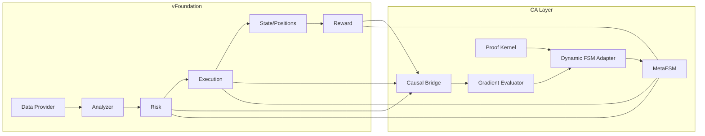

# vFoundation‑CA: Філософія та математичне обґрунтування (v1.0)

## 0. Мета та позиціювання

**Що це:** концепція і матмодель надбудови до vFoundation, яка додає системі

1. цілеспрямованість (осілений вектор мети),
2. самонавчальну каузальну координацію між доменами (Causal‑Adaptive FSM, далі **CA‑FSM**),
3. шар формальної перевірки консистентності (**Proof Kernel**) з «онтологічним чек‑сумом».

**Навіщо:** перевести систему з рівня «рефлекторного автомата» до рівня «керованої емерджентності»: правила поведінки не лише виконуються, а й **адаптуються** на основі наслідків і **верифікуються** на сумісність з інваріантами.

---

## 1. Філософія (триєдність інженерного ІІ)

**Детермінізм (FSM)** + **Адаптивність (RL/Optuna‑подібна оптимізація)** + **Пояснюваність (каузальний слід)**.

* FSM дає передбачуваність і тестованість (контроль станів і інваріантів).
* Адаптація дає еволюцію поведінки без ручного тюнінгу.
* Каузальність дає «чому саме» — зв’язок дії і результату в конкретному контексті.

**Принцип:** «Ніякої магії чорних скриньок там, де потрібні гарантії». Адаптуються лише **параметризовані** переходи і гварди, під контролем інваріантів і формальних перевірок.

---

## 2. Системна модель

Позначимо:

* (S) — скінченна множина станів FSM; (E) — множина подій; (A) — клас дій; \n- Перехід — кортеж ((s, e, s', a, \theta)), де (\theta) — вектор параметрів гвардів/ваг.
* Епізод (\mathcal{E}): від наміру (TRADE_INTENT) до термінальної події (POSITION_CLOSED/ABORT).

**Meta‑FSM** оперує політикою переходів (\Pi_\theta: S\times E \to S\times A), де (\theta) — адаптивні параметри гвардів/ваг.

**Доменна декомпозиція:** Analyzer → Risk → Execution → State → Reward; усі домени емісують каузальні події в реєстр.

---

## 3. Каузальний міст (Causal Bridge)

Веде реєстр подій:
[
\mathsf{CE} = \langle \text{rid}, s, e, s', a, x, m, t \rangle,
]
де (x) — контекст (фічі/пороги), (m) — метрики епізоду (PnL, CVaR, latency тощо).

На графі (G=(V,,\mathcal{R})): вершини — стани, ребра — метапереходи ((s,e)\to s') з вагами (w_{(s,e\to s')}\approx \mathbb{E}[AG\mid (s,e\to s')]).

Агрегатор обчислює (\hat w) через експоненційне згладжування:
[
\hat w_{t+1} = (1-\alpha),\hat w_t + \alpha,AG_t,\quad \alpha\in (0,1].
]

---

## 4. Осьовий градієнт (Axial Gradient, **AG**)

AG — скалярна цільова функція «напрямку правильності» на епізод.

Приклад адитивної форми (налаштовується):
[
AG = w_{p},\tilde{pnl} + w_{c},(\tau_{cvar} - \tilde{cvar})*+ + w*{s},(1-\tilde{stab}) + w_{\ell},(\tau_{lat} - \tilde{lat})*+.
]
Тут (\tilde{\cdot}) — нормовані метрики (\in[0,1]), ((x)*+=\max(x,0)).

**Вимоги:**

* Ліпшицевість по кожному аргументу (обмежені градієнти);
* EMA‑фільтр для шуму;
* монотонність за «бажаними» напрямами (більший AG — кращий епізод).

**Зміст:** AG — це «ось» поведінки системи; **вектор мети** проектується в скалярну оцінку, зручну для оптимізації.

---

## 5. Оцінювання AG і надійність (концентраційні межі)

Нехай ({AG_i}_{i=1}^n) — незалежні оцінки для фіксованого ребра графа. Середнє (\bar{AG}) дає оцінку (\mu). За Гефдінгом (Hoeffding):
[
\Pr\big(|\bar{AG}-\mu|>\varepsilon\big)\le 2\exp\Big(!-\tfrac{2n\varepsilon^2}{(b-a)^2}\Big),
]
якщо (AG_i\in[a,b]). Це задає (n) для бажаної похибки/довіри, щоб **не оновлювати політику на шумі**.

---

## 6. Механізм оновлення (Gradient Evaluator)

Ми оптимізуємо параметри (\theta) політики переходів (ваги/пороги гвардів).

### 6.1 Онлайн‑градієнт (стохастична апроксимація)

[
\theta_{t+1} = \Pi_{\Theta}\Big(\theta_t + \eta_t,g_t\Big),\quad \sum_t \eta_t = \infty,\ \sum_t \eta_t^2<\infty,
]
де (g_t\propto (\bar{AG}-\text{baseline}),\partial f/\partial\theta) — оцінка градієнта (через скінченні різниці або SPSA), (\Pi_\Theta) — проєкція в допустиму область.

**Твердження (ескіз):** за умов обмеженого шуму, ліпшицевості та умов Роббінса–Монро на (\eta_t), послідовність (\theta_t) збігається до стаціонарної точки (\nabla J(\theta^*)=0), де (J) — згладжене очікування AG.

### 6.2 Дискретний тюнер (Optuna‑подібний)

Для кожного гварда (\tau): пробуємо (\tau\pm\delta), обираємо напрямок з кращим (\bar{AG}); крок зменшуємо геометрично. Це **безградієнтний** метод, стійкий до негладкості.

---

## 7. Динамічна FSM (параметризовані гварди)

Кожний перехід описується політикою:

```yaml
- from: OPEN
  event: PARTIAL_FILL
  to: OPEN
  guard: "fill_ratio < 1 and time_open < T_max"
  weight: 0.72
```

CA‑FSM модифікує (\tau) в guard/weight у рантаймі, **не змінюючи семантики доменів**. Всі зміни — атомарні, версіоновані і журналяться.

---

## 8. Proof Kernel (формальна консистентність)

Мета — **заборонити** застосування оновлення, яке робить поведінку несумісною з інваріантами.

### 8.1 Інваріанти (LTL/безпека)

Приклади властивостей у LTL:

* **Safety:** (\mathbf{G},\neg\texttt{duplicate_entry})
* **Liveness:** (\mathbf{G}(\texttt{ENTRY_FILLED}\to \mathbf{F},\texttt{BRACKETS_PLACED}))
* **Reduce‑only:** (\mathbf{G}(\texttt{OPEN}\to \mathbf{G},\texttt{BRACKETS.reduce_only}))

Runtime‑монітор компілює ці формули в автомати й перевіряє трасу перед застосуванням апдейту.

### 8.2 Онтологічний чек‑сум ("2+2=4")

Канонізуємо твердження (S) (оновлення переходу + контекст). Визначаємо
[ H(S) = \mathrm{hash}(S)\bmod P. ]
Оновлення приймається лише якщо (H(S)=c) (напр., 4). Це **детермінований, некриптографічний** gate, який унеможливлює «м’які» несанкціоновані модифікації та забезпечує стабільність простору станів.

> NB: чек‑сум **не доводить істинність** семантики, але є **тампер‑евіденсом** і жорстким фільтром для класу дозволених перетворень. Семантику захищають LTL‑інваріанти.

### 8.3 Truth‑Score та керування

[ TS = \frac{#\text{valid proofs}}{#\text{actions}}. ]
Гейтинг: якщо (TS<\tau_{TS}) на ковзаючому вікні, адаптації блокуються, активується **safe‑policy** і можливий rollback.

---

## 9. Shadow‑середовище та ідентифікація

7‑денний Shadow‑режим як стандарт. Епізоди відтворювані (seed), шум керований. Оцінюємо: AHL, Causal Coverage, TS, Regret. Будуємо DAG «гарячих» шляхів і heatmap ваг.

---

## 10. Безпека адаптацій

* Rate‑limit змін ((K)/год).
* Auto‑freeze щодоби, snapshot політики.
* Rollback до останнього стабільного чекпойнта при деградації SLO/TS.
* Ідемпотентність апдейтів (ключі idem/update‑id).

---

## 11. Псевдокод (ядро контуру)

```python
async def ca_fsm_cycle(ep):
    # 1) каузальний запис
    for ev in ep.events:
        await CB.record(ev)

    # 2) після завершення епізоду — AG
    ag = axial_gradient(ep.metrics)  # EMA‑фільтр всередині

    # 3) пропозиції оновлень
    G = await CB.graph_snapshot()
    props = await GE.propose_updates(G)

    # 4) перевірка доказів
    valid = []
    for p in props:
        if LTL.monitor_accepts(p) and PK.verify(p).verified:
            valid.append(p)

    # 5) гейтинг за Truth‑Score
    if truth_score() >= cfg.proof.ts_min:
        await DA.apply_updates(valid)
    else:
        await DA.freeze_and_safe_mode()
```

---

## 12. Математичні гарантії (ескізи)

**(1) Стабільність параметрів.** За умов Роббінса–Монро на (\eta_t) і обмеженості шуму, стохастична апроксимація сходиться до множини стаціонарних точок (\Theta^*). Проєкція (\Pi_\Theta) зберігає обмеженість.

**(2) Надійність оцінки AG.** Обираючи (n) за Гефдінгом для цільової (\varepsilon,\delta), гарантуємо, що апдейти ґрунтуються на відхиленнях, які статистично значущі з імовірністю (1-\delta).

**(3) Збереження інваріантів.** LTL‑монітор гарантує, що семантичні властивості (safety/liveness) не порушуються жодним застосованим оновленням. Онтологічний чек‑сум забезпечує тампер‑евіденс простору дозволених трансформацій.

**(4) Контроль «гойдання».** Введення дроселю (rate‑limit) та EMA‑фільтру знижує варіацію оновлень; для малих (\eta) зміни монотонно покращують очікуваний AG у околі стаціонарної точки (локальна ліпшицевість і слабка псевдоопуклість).

---

## 13. Інтеграція у vFoundation

* Додаються пакети: `causal_bridge/`, `gradient_evaluator/`, `proof_kernel/`, `dynamic_adapter/`.
* Meta‑FSM відкриває API для атомарного оновлення політик.
* Домени не змінюють семантику; лише емісують CE‑події.
* Shadow‑режим — обов’язковий перед staging/live.

---

## 14. Обмеження і ризики

* Хибна каузальність (сплутування): потребує інструментальних змінних/регуляризації.
* Нестаціонарність середовища: періодична переоцінка baseline, детектор дрейфу.
* Осциляції при агресивних (\eta): вводити адаптивне (\eta_t), температурне згладжування гвардів.
* Чек‑сум не є формальним доведенням семантики — для критичних властивостей покладатися на LTL‑моніторинг і (де можливо) на попередню верифікацію переходів.

---

## 15. SLO/SLI та спостережність

* **AHL, TS, Causal Coverage, Regret@N, Stability Drift** — ключові SLI.
* Логи: `causal_event`, `ag_eval`, `ltl_monitor`, `proof_record`, `policy_update`.
* Дашборди: DAG heatmap, еволюція гвардів, TS‑трекер, freeze/rollback історія.

---

## 16. Дорожня карта впровадження

1. Shadow‑ядро (7 днів): CB, GE (безградієнтний тюнер), PK (LTL+checksum), DA.
2. Staging: консервативні кроки, auto‑freeze, оновлення раз/год, TS‑гейтинг.
3. Live: повний цикл, щоденні snapshot, інцидент‑процедури, audit.
4. R&D: SPSA/СМА‑ES тюнер, причинні тестування (A/B з інструментальними змінними), формальна верифікація вибіркових переходів.

---

## 17. Висновок

vFoundation‑CA перетворює архітектуру з набору розумних доменів на **цілісну, самонавчальну і формально контрольовану систему**. Каузальна адаптація дає еволюцію, Proof Kernel — гарантії консистентності, Shadow — безпечну стабілізацію. Це «інженерний шлях» до емерджентного мислення без хаосу.


# vFoundation-CA v1.0

## Causal-Adaptive Meta-FSM + Proof-Verification Layer

**Рівень:** інженерна специфікація (OpenAI-style)
**Мова:** Python 3.11+ (asyncio) · Pydantic v2 · ruff/mypy strict
**Область:** теми 4–6 (організм vFoundation → Causal-Adaptive FSM → Proof-Layer)

---

## 0. Резюме (TL;DR)

Мета — додати до vFoundation надбудову **цілеспрямованої координації й автоеволюції**:

1. **Causal-Adaptive FSM (CA-FSM):** meta-рівень, який **сам** коригує переходи FSM на основі причинно-наслідкової пам’яті та **осьового градієнта** (цільова функція).
2. **Causal Bridge:** каузальний реєстр переходів `state→event→state'` із їхнім впливом на метрики.
3. **Proof-Verification Layer:** формальна перевірка **логічної консистентності** кожної дії/переходу (онтологічний checksum “2+2=4”), truth-score, gating/rollback.

Система стає не лише детермінованою (FSM), а й **пластичною** (адаптує правила) та **перевіряє істинність** своїх змін до застосування.

---

## 1. Цілі, KPI, SLO

### 1.1 KPI/SLI

* **Adaptation Half-Life (AHL):** час до збіжності ваг переходів після зміни середовища, год.
* **Causal Coverage:** частка переходів FSM, де є валідний каузальний запис, %.
* **Truth Integrity:** `truth_score = proofs_valid / actions_total`, %.
* **Regret@N:** середній “жаль” за N епізодів після адаптації (негативна різниця з найкращою збереженою політикою).
* **Stability Drift:** дисперсія рішень FSM під однаковим контекстом за вікно T.

### 1.2 SLO

* AHL ≤ 24 год у shadow; ≤ 72 год у live.
* Causal Coverage ≥ 95%.
* Truth Integrity ≥ 99.5% (gating блокує, якщо < 99%).
* Regret@100 ≤ 5% проти останнього freeze.
* 0 незадокументованих змін ваг/гвардів (усі через CA-FSM API).

---

## 2. Термінологія

* **Domain:** ізольований модуль vFoundation (risk, exec, reward, analyzer…).
* **FSM / Meta-FSM:** станова машина доменів / координаційна над-FSM.
* **CA-FSM:** meta-шар, який **оновлює** ваги та гварди переходів FSM онлайн.
* **Causal Bridge (CB):** реєстр `⟨from,event,to,context,metrics→result⟩`.
* **Axial Gradient (AG):** скалярна цільова функція, що визначає “правильність” напряму.
* **Proof Kernel (PK):** шар формальної перевірки консистентності переходів (checksum).
* **Truth Score (TS):** частка дій із валідним доказом/контрольним штампом.

---

## 3. Архітектура (огляд)



* **CB** збирає причинні записи з доменів.
* **GE** обчислює AG та updates для переходів.
* **PK** перевіряє логічну консистентність (gating/rollback).
* **DA** застосовує зміни до Meta-FSM/FSM.

---

## 4. Дані й схеми

### 4.1 Події каузального реєстру (Pydantic)

```python
class CausalEvent(BaseModel):
    rid: str
    symbol: str
    from_state: str
    event: str
    to_state: str
    context: dict[str, Any]  # snapshot ознак/порогів/середовища
    metrics: dict[str, float]  # pnl_delta, cvar, latency, etc.
    ts: datetime
```

### 4.2 Запис доказу (Proof)

```python
class ProofRecord(BaseModel):
    rid: str
    statement: str        # нормалізована формула дії/висновку
    checksum: int         # натур. число, мод P => очікується == CONST (напр. 4)
    verified: bool
    why: str              # причина/аксіома/референс
    ts: datetime
```

### 4.3 Актуальна політика переходів (модифікована FSM)

```python
class TransitionPolicy(BaseModel):
    from_state: str
    event: str
    to_state: str
    guard: str            # вираз (safe subset) над контекстом
    weight: float         # 0..1 пріоритизація при конфліктах
    version: str          # semver
```

---

## 5. Axial Gradient (AG)

### 5.1 Визначення

AG — скалярна оцінка напрямку, яку CA-FSM прагне **максимізувати**.
Рекомендована форма (налаштовується в конфігу):

```
AG = w_pnl * pnl_delta_norm
   + w_cvar * (cvar_target - cvar_observed)_+
   + w_stab * (1 - stability_ratio)
   + w_lat  * (latency_budget - latency_p95)_+
```

* `_+` = позитивна частина (max(x, 0)).
* Всі складові нормалізовані до [0,1].
* Ваги w_* визначають пріоритет (в конфігу/версіях).

### 5.2 Вимоги

* AG **MUST** бути стабільним до шуму → EMA фільтр (alpha ∈ [0.05..0.2]).
* AG обчислюється **на епізод** (від intent до close) і на вікно з K епізодів.

---

## 6. Causal Bridge (CB)

### 6.1 Обов’язки

* Приймати всі `CausalEvent` із доменів.
* Агрегувати з AG → **edge weights** для `from,event→to`.
* Вести `causal_graph` (DiGraph) з вагами, підсвічувати “гарячі” маршрути.

### 6.2 Інтерфейс

```python
class CausalBridge(Protocol):
    async def record(event: CausalEvent) -> None: ...
    async def aggregate(rid: str) -> dict[str, float]: ...  # підсумок за епізод
    async def graph_snapshot() -> "DiGraph": ...
```

---

## 7. Gradient Evaluator (GE)

### 7.1 Принцип

* На кожен перехід `⟨from, event, to⟩` будуються ковзаючі статистики: `AG_mean, AG_var, count`.
* Оновлення ваг/гвардів пропонується, коли:
  `count ≥ N_min` **і** `AG_mean` відрізняється від baseline більше за δ.

### 7.2 Update-правило (легкий онлайн-градієнт)

```
w_new = clip(w_old + η * (AG_mean - AG_baseline), 0.0, 1.0)
guard_new = tune_guard(guard_old, direction=sign(AG_mean - AG_baseline))
```

* `η` — швидкість навчання (0.01..0.1).
* `tune_guard` — детермінована функція, яка змінює пороги/константи в guard (напр., `signal_confidence > 0.72 → 0.74`).

### 7.3 Інтерфейс

```python
class GradientEvaluator(Protocol):
    async def propose_updates(graph: "DiGraph") -> list[TransitionPolicy]: ...
```

---

## 8. Proof-Verification Layer (PK)

### 8.1 Ідея

Перед застосуванням будь-якої зміни політики/переходу — **формальна перевірка** консистентності.
Мінімальний, але жорсткий checksum-критерій (“2+2=4” як онтологічний інваріант).

### 8.2 Формалізація checksum

* Нормалізуємо твердження (перехід + контекст) у канонічний рядок `S`.
* Обчислюємо `H = hash(S) mod P`, де `P` — велике просте.
* Вимагаємо `H == CONST` (наприклад, 4) для класів тверджень, що підпадають під інваріанти.
* Якщо `H != CONST` → **reject** або **defer** (потрібен ручний/LLM-розбір).

> Це **не математичний доказ** у повному сенсі, але **жорсткий детермінований gate** проти “несумісних” змін.

### 8.3 Truth Score

`TS = valid_proofs / total_actions`.
Gating правила:

* Якщо `TS < 99%` на вікні `M` епізодів → **заморозити** DA, перейти в **safe policy**.
* Якщо `TS` деградує двічі поспіль → **rollback** до останнього freeze.

### 8.4 Інтерфейс

```python
class ProofKernel(Protocol):
    def normalize(statement: TransitionPolicy, context: dict) -> str: ...
    def checksum(s: str) -> int: ...
    def verify(policy: TransitionPolicy, context: dict) -> ProofRecord: ...
```

---

## 9. Dynamic FSM Adapter (DA)

### 9.1 Обов’язки

* Приймати пропозиції `TransitionPolicy` від GE.
* Запускати PK.verify для кожної.
* Якщо пройшло — **атомарно** застосувати до Meta-FSM/FSM із версіонуванням.
* Логувати diff у **policy-ledger**.

### 9.2 API

```python
class DynamicFSMAdapter(Protocol):
    async def apply_updates(upd: list[TransitionPolicy]) -> ApplyReport: ...
    async def snapshot() -> list[TransitionPolicy]: ...
```

---

## 10. Життєвий цикл / режими

* **Shadow (7 днів):** активні GE+PK+DA; без зовнішніх API; агресивні η, δ.
* **Staging:** mirror реального фіду; conservative η, δ; TS gating увімкнено.
* **Live:** conservative; DA під throttle; auto-freeze кожні 24 год; rollback готовий.

**Щоденний snapshot:** `policy_vX.json`, `causal_graph.gexf`, `truth_metrics.json`.

---

## 11. Безпека та стабільність

* **Freeze/Rollback:** будь-яка зміна політики — через DA; останні 7 snapshot — доступні.
* **Rate-limit адаптацій:** не більше `K` змін/год; між змінами — мінімальний horizon.
* **Fail-safe:** якщо PK падає або TS < порога → Meta-FSM перемикається в **safe-policy** (статичні гварди, zero-η).
* **Idempotency:** усі апдейти — з `policy_update_idem_key`.

---

## 12. Спостережність

* **Логи JSONL:** `causal_event`, `ag_eval`, `proof_record`, `policy_update`, `gating_decision`.
* **Метрики Prometheus:**

  * `ca_events_total{edge=...}`
  * `ag_value{edge=...}`
  * `truth_score`
  * `policy_updates_total{result=applied|rejected}`
  * `rollback_total`
* **Візуалізація:** DAG “гарячих” шляхів; heatmap AG по ребрах; історія ваг і гвардів.

---

## 13. Тестова стратегія

* **Unit:** PK.checksum детермінований; normalize інваріантний; tune_guard монотонний.
* **Property-based:** зміни guard не повинні робити FSM непрохідним/цикл без виходу.
* **Integration:** GE→PK→DA ланцюг; відхилення змін при TS↓.
* **E2E (Shadow):** сценарії з partial fills, ratelimits, нестабільністю; збіжність AG.
* **Chaos:** шум у metrics, дроп подій; перевірка, що DA не “гойдає” FSM без AG-сигналу.
* **Mutation:** ≥70% на ca-ядрі.
* **Coverage:** ≥90% на PK/GE/DA.

---

## 14. Конфігурація (витримка)

```yaml
ca_fsm:
  learning_rate: 0.05           # η
  delta_min: 0.02               # δ
  updates_per_hour_max: 5
  window_episodes: 100
  weights:
    w_pnl: 0.6
    w_cvar: 0.25
    w_stab: 0.1
    w_lat: 0.05

proof:
  prime_modulus: 2147483647
  target_const: 4
  gate_truth_score_min: 0.995
  window_actions: 1000

modes:
  shadow: {lr: 0.08, delta_min: 0.03}
  live:   {lr: 0.03, delta_min: 0.03}
```

---

## 15. Інтеграція з vFoundation

* **Домени не змінюються.** Додається **CA Layer**: `causal_bridge/`, `gradient_evaluator/`, `proof_kernel/`, `dynamic_adapter/`.
* **Meta-FSM** розширюється API для оновлень переходів.
* **Shadow-env** використовується як стандартний контур стабілізації перед live.

---

## 16. Міграція з моноліту

1. Витягти таблицю переходів FSM у `TransitionPolicy[]`.
2. Увімкнути CB-логування подій/метрик.
3. Прогнати **7-денний Shadow** з CA-шаром (активні GE+PK+DA).
4. Freeze найкращий snapshot → Staging → Live.

---

## 17. Відмови та реакції

* **AG noise spike:** підвищити EMA-фільтр; тимчасово знизити η.
* **TS падіння:** зупинити DA; safe-policy; розслідування proof-ledger.
* **Деградація SLO:** auto-rollback до останнього freeze; issue в “risk-register”.

---

## 18. DoD (Definition of Done)

* [ ] CB збирає ≥95% переходів; DAG/heatmap генерується.
* [ ] GE стабільно пропонує апдейти з дельтою > δ; η/δ керовані.
* [ ] PK блокує невалідні апдейти; TS ≥ 99.5% на вікні.
* [ ] DA атомарно застосовує; є policy-ledger + snapshots.
* [ ] Shadow-7d: AHL ≤ 24 год; Regret@100 ≤ 5%.
* [ ] Staging: zero incidents; Live: freeze/rollback пройдені у навчанні.
* [ ] ruff/mypy/coverage/mutation у нормі.

---

## 19. Псевдокод (ядро)

```python
async def ca_fsm_tick(ctx: Context):
    ev = await cb.record(await ctx.next_event())
    if ev.is_terminal:
        ep = await cb.aggregate(ev.rid)        # підсумок епізоду
        ag = axial_gradient(ep.metrics)        # EMA
        graph = await cb.graph_snapshot()
        props = await ge.propose_updates(graph)
        valid = []
        for p in props:
            proof = pk.verify(p, context=ep.context)
            await log_proof(proof)
            if proof.verified:
                valid.append(p)
        if truth_score() >= cfg.proof.gate_truth_score_min:
            rep = await da.apply_updates(valid)
            await log_policy_update(rep)
        else:
            await da.freeze_and_safe_mode()
```

---

## 20. Дорожня карта

* **Phase A (Shadow):** CA-ядро, PK checksum, DA застосування, 3 сценарії; AHL/TS/Regret метрики.
* **Phase B (Staging):** conservative η/δ, throttling, auto-freeze, dashboards.
* **Phase C (Live):** повний цикл; щоденні snapshots; інцидент-процедури; audit-логіка.

---

### Висновок

Ця специфікація перетворює vFoundation з “рефлекторної” FSM-системи на **цілеспрямований, самонавчальний і верифікований організм**.
CA-FSM забезпечує **еволюцію**, Proof-Layer — **консистентність**, Shadow-env — **безпечну стабілізацію**.
Результат — керована емерджентність без хаосу.
