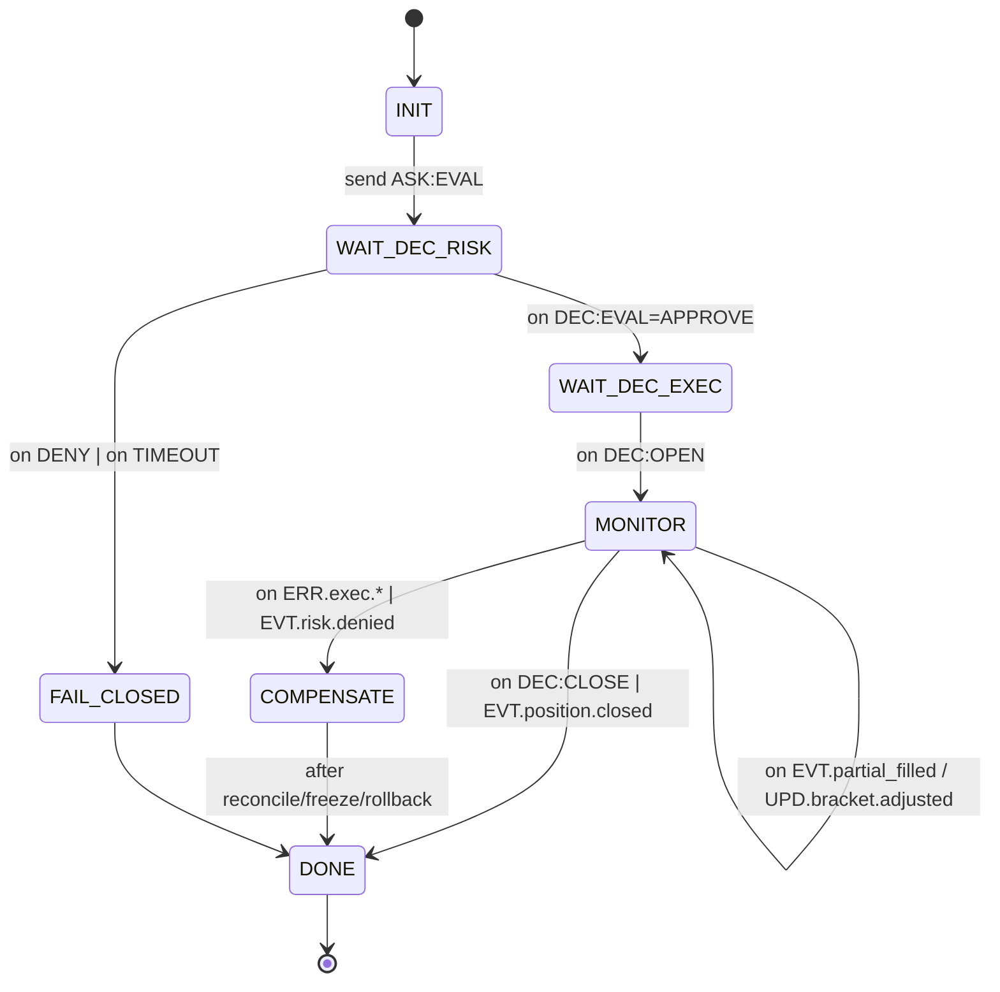

# docs/CENTRAL_FSM_SPEC.md

## 1)  ú µ Ç    π  æ ±   è ≥

 í ∏ ∑ Ω   á   î ** Ü µ Ω Ç     ª å Ω ∏ π  ∫ æ æ   ¥ ∏ Ω   Ü ñ π Ω ∏ π  à    **  ∑  ¥ ≤ æ Ö FSM:

* **OrchestratorFSM (TRADE Coordinator)** ‚ î  ∫ µ   É î  ∂ ∏ Ç Ç î ≤ ∏ º  Ü ∏ ∫ ª æ º `rid`  É  ≥     è á æ º É  à ª è Ö É.
* **MetaFSM (Registry/Governance)** ‚ î  ¥ æ º µ Ω Ω ∏ π    µ î   Ç  ,  ∑ ¥ æ   æ ≤‚ ô è,    É º ñ   Ω ñ   Ç å    Ö µ º, freeze/failover.

## 2)  ö æ Ω Ç     ∫ Ç ∏ (   ª æ ≤ Ω ∏ ∫ ‚Üí    Ö µ º ∏)

** °   ñ ª å Ω ñ    æ ª è ( É   ñ    æ ≤ ñ ¥ æ º ª µ Ω Ω è):** `rid(uuid)`, `span`, `verb`, `domain`, `ttl_profile‚àà{critical,fast,normal,ml_slow,background}`, `policy.idempotent_key`, `why‚â§80`, `why_explain_ref?`, `data_ref?`, `sig?`.

### 2.1 OrchestratorFSM ‚ î  ∫ ª é á æ ≤ ñ  ≤ µ   ± ∏

* `ASK:EVAL` ( ¥ æ `risk_strategy`), `DEC:EVAL(APPROVE|DENY)` ‚ î    æ ≤ µ   Ω µ Ω Ω è  É  ∫ æ æ   ¥ ∏ Ω   Ü ñ é.
* `ASK:OPEN|CLOSE` ( ¥ æ `execution_position`), `DEC:OPEN|CLOSE` ‚ î    ñ ¥ Ç ≤ µ   ¥ ∂ µ Ω Ω è  ≤ ∏ ∫ æ Ω   Ω Ω è.
*  ü æ ¥ ñ ó      æ   Ç µ   µ ∂ µ Ω Ω è: `EVT.position.partial_filled`, `UPD.bracket.adjusted`, `ERR.exec.*`, `EVT.risk.denied`.
*  ° ª É ∂ ± æ ≤ ñ: `EVT.orch.timeout`, `EVT.orch.compensate`, `EVT.orch.freeze_position`.

### 2.2 MetaFSM ‚ î  ∫ ª é á æ ≤ ñ  ≤ µ   ± ∏

* `EVT.registry.heartbeat` ( ≤ ñ ¥  ¥ æ º µ Ω ñ ≤) ‚Üí `UPD.registry.status` ( ∑ ¥ æ   æ ≤‚ ô è/ ≤ µ     ñ ó).
* `ERR.registry.schema_mismatch` ‚Üí `EVT.registry.freeze_domain` (governance freeze).
* `EVT.registry.schema_canary_ok|fail`.

>  £   ñ    Ö µ º ∏ ‚ î Draft 2020‚ ë12; `$id`/`$schema`  æ ± æ ≤‚ ô è ∑ ∫ æ ≤ ñ; additive‚ ëonly  ≤ µ     ñ æ Ω É ≤   Ω Ω è.

## 3)  û   ∫ µ   Ç     Ü ñ è ‚ î  º æ ¥ µ ª å    Ç   Ω ñ ≤

** Ü Ω ≤     ñ   Ω Ç ∏:**  º æ ≤ á   Ω Ω è Risk = `DENY`;  É   ñ `ASK/DEC`  º   é Ç å `policy.idempotent_key`;  ¥ É ± ª ñ ∫   Ç ∏ ‚ î no‚ ëop; out‚ ëof‚ ëorder    æ ¥ ñ ó        ∫ É é Ç å   è  ¥ æ `DEC:OPEN` ( ± É Ñ µ    Ω   `rid`).

## 4)  ¢   π º µ   ∏, TTL, CB,    µ Ç     ó

* **TTL-     æ Ñ ñ ª ñ:** critical(50 º  )/fast(200 º  )/normal(2  )/ml_slow(10  )/background(30  ).
* **Risk‚ ëwait  Ç   π º µ  ** = critical;    æ  Ç   π º   É Ç É ‚Üí `FAIL_CLOSED` + `ERR:TIMEOUT`  É WAL.
* **CB (circuit breaker)**  Ω    ¥ æ º µ Ω:  ≤ ñ ¥ ∫   ∏ Ç Ç è      ∏ `timeout_rate>1%`    ± æ `5xx spike`;  ¥ µ ≥     ¥   Ü ñ è  º     à   É Ç ∏ ∑   Ü ñ ó ( ≤ ñ ¥   ñ ∫   Ω Ω è  Ω µ æ   ª   á µ Ω ∏ Ö `ASK`).
* ** † µ Ç     ó**:  Ç ñ ª å ∫ ∏  ¥ ª è ** ñ ¥ µ º   æ Ç µ Ω Ç Ω ∏ Ö**  æ   µ     Ü ñ π ( Ω       ∏ ∫ ª   ¥,    æ ≤ Ç æ   `ASK:EVAL`).

## 5)  Ü ¥ µ º   æ Ç µ Ω Ç Ω ñ   Ç å  ñ  ¥ µ ¥ É   ª ñ ∫   Ü ñ è

*  ö ª é á  ∑    ∑   º æ ≤ á É ≤   Ω Ω è º: `domain:verb:{position_id|clientOrderId|rid}`.
* ** ü æ ≤ Ç æ   ∏**  ± É ¥ å- è ∫ æ ≥ æ `ASK/DEC`  ∑  Ç ∏ º      º ∏ º  ∫ ª é á µ º ‚ î **no-op**.
* **Out-of-order**:    æ ¥ ñ ó  ¥ æ `DEC:OPEN`  ± É Ñ µ   ∏ ∑ É é Ç å   è,    ª µ  Ω µ  ∑ º ñ Ω é é Ç å    Ç   Ω;    ñ   ª è `DEC:OPEN` ‚ î      æ ≥     é Ç å   è  É MONITOR.

## 6)  ö æ º   µ Ω     Ü ñ ó  Ç    ∑ É   ∏ Ω ∫ ∏ (COMPENSATE)

 ¢   ∏ ≥ µ   ∏: `ERR.exec.rejected`, `EVT.risk.denied`,  ¥ æ ≤ ≥ ∏ π  Ç   π º   É Ç,  Ω µ É ∑ ≥ æ ¥ ∂ µ Ω ñ   Ç å    Ç   Ω É.
 î ñ ó: freeze    æ ∑ ∏ Ü ñ ó,    ∫     É ≤   Ω Ω è peer- æ   ¥ µ   ñ ≤,  ≤ ∏ º æ ≥      Ω     à æ Ç É,  ∑     ∏    É WAL + panic-bundle,      æ ≤ ñ â µ Ω Ω è Ops.

## 7) XAI  ñ why_chain

*  £  ∫ æ ∂ Ω æ º É `DEC/ERR` ‚ î  ∫ æ   æ Ç ∫ ∏ π `why‚â§80` ( ≥     è á ∏ π  à ª è Ö).
* **why_chain**    ≥   µ ≥ É î Ç å   è  É OrchestratorFSM  ñ  ¥ æ   Ç É   Ω ∏ π  á µ   µ ∑ `/debug/{rid}` (     ∑ æ º  ñ ∑ trace).
*  † æ ∑ ≥ æ   Ω É Ç ñ    æ è   Ω µ Ω Ω è ‚ î `why_explain_ref` (cold‚ ëstorage),  Ω µ  ≤   ª ∏ ≤   é Ç å  Ω   p95.

## 8) DR / WAL / Replay

* WAL JSONL append‚ ëonly, hash‚ ë ª   Ω Ü é ≥,  ¥ æ ± æ ≤ ∏ π Merkle‚ ëroot.
* Snapshots  ñ ∑  º µ Ç   ¥   Ω ∏ º ∏ `wal_range`  Ç   `merkle_root`.
* `/replay`  ≤ ñ ¥ Ç ≤ æ   é î    Ü µ Ω     ñ ó 1:1; **replay‚ ësuccess** ‚ î  æ ± æ ≤‚ ô è ∑ ∫ æ ≤ ∏ π SLI.

## 9) Security (Ed25519, RBAC/ABAC, redaction)

* High‚ ërisk `DEC/CMD` (OPEN/CLOSE/ADJUST) ‚ î    ñ ¥   ∏   É é Ç å   è Ed25519;  ∫ ª é á ñ  ≤ KMS.
* RBAC/ABAC  Ω   `/debug`, promote/rollback, registry freeze.
* Redaction  ¥ ª è    µ ∫   µ Ç ñ ≤/PII  ≤  ª æ ≥   Ö;  æ ∫   µ º ∏ π secure‚ ëlog  ∫   Ω   ª.

## 10)  ï Ω ¥   æ π Ω Ç ∏      æ   Ç µ   µ ∂ Ω æ   Ç ñ

* `/health` ‚ î liveness/readiness; `/metrics` ‚ î p50/p95/timeout/queue depth;
* `/debug/{rid}` ‚ î why_chain + trace + refs; `/replay` ‚ î  ≤ ñ ¥ Ç ≤ æ   µ Ω Ω è RID/ ¥ ñ       ∑ æ Ω É; `/statdump` ‚ î    æ Ç æ á Ω ñ  ª ñ á ∏ ª å Ω ∏ ∫ ∏/   Ç   Ω ∏.

## 11)  ü   ∏ ∫ ª   ¥ ∏  ∫ æ Ω Ç     ∫ Ç ñ ≤ ( É   ∏ ≤ ∫ ∏)

**ASK:EVAL ( ¥ æ Risk):**    æ ª è: `rid, verb=ASK:EVAL, domain=risk_strategy, ttl_profile=critical, signal_code, confidence, context[8..16], metrics{‚ ¶}, data_ref?, why?`

**DEC:EVAL:**    æ ª è: `rid, verb=DEC:EVAL, verdict‚àà{APPROVE,DENY}, limits{max_f,max_leverage}? , why, sig`.

**ASK:OPEN ( ¥ æ Exec):**    æ ª è: `rid, ttl_profile=fast, policy.idempotent_key, order{symbol,side,qty,price_mode,reduce_only?}, why?`.

**EVT.position.partial_filled:**    æ ª è: `rid, position_id, filled_qty, remaining_qty, price, why, span`.

## 12)  ¢ µ   Ç‚ ë º   Ç   ∏ Ü è ( Ü µ Ω Ç     ª å Ω ∏ π  à    )

* **Contract**: JSON‚ ëSchema  ≤   ª ñ ¥   Ç æ   ∏  ¥ ª è  ≤   ñ Ö verbs; additive‚ ëonly diffs.
* **Integration**: EVAL‚ÜíOPEN‚ÜíMONITOR‚ÜíCLOSE; duplicates; out‚ ëof‚ ëorder; compensation; freeze.
* **Chaos**:  á     æ ≤    ¥ µ ≥     ¥   Ü ñ è Risk/Exec; CB‚ ëtrigger; mass duplicate; WAL‚ ëcorrupt ( ≤ ñ ¥ Ö ∏ ª µ Ω Ω è).
* **Perf (smoke)**: p95(hot) ‚⧠50  º  ; router p95 ‚⧠10  º  .
* **DR**: replay  É   ñ Ö e2e    Ü µ Ω     ñ ó ≤ 1:1; snapshot rollback  Ç µ   Ç.

## 13) KPI / SLI

Latency per hop; timeout_rate; CB‚ ëopen%; replay‚ ësuccess%; state‚ ëdrift%; WHY‚ ëcoverage%;    ñ ¥   ∏     Ω ñ DEC/CMD%; redaction coverage.

## 14)  ú µ ∂ ñ  ≤ ñ ¥   æ ≤ ñ ¥   ª å Ω æ   Ç ñ

* **OrchestratorFSM**  Ω µ  ∑ ± µ   ñ ≥   î  ¥ æ º µ Ω Ω ∏ Ö    Ç   Ω ñ ≤;  Ç ñ ª å ∫ ∏ RID‚ ë ∫ æ Ω Ç µ ∫   Ç  ñ  Ç   π º µ   ∏.
* **MetaFSM**  Ω µ      ∏ π º   î  Ç æ   ≥ æ ≤ ∏ Ö    ñ à µ Ω å;  ª ∏ à µ    µ î   Ç  , health, governance freeze.

## 15)  í     æ ≤   ¥ ∂ µ Ω Ω è  ≤    æ   æ ∂ Ω ñ π  ≥ ñ ª Ü ñ ( ∫   æ ∫ ∏)

1.  î æ ¥   Ç ∏  ∑     ∏   ∏ Orchestrator/MetaFSM  É `dictionaries/global_v2_2.yaml` ‚Üí  ∑ ≥ µ Ω µ   É ≤   Ç ∏ `schemas/`.
2.  ü ñ ¥ Ω è Ç ∏ `/health /metrics /debug /replay`; WAL round‚ ëtrip.
3.  ü ñ ¥ ∫ ª é á ∏ Ç ∏ `execution_position`  á µ   µ ∑ Orchestrator (shadow),  ∑ ≥ æ ¥ æ º ‚ î `risk_strategy`.
4.  £ ≤ ñ º ∫ Ω É Ç ∏ why_chain,      Ω ñ ∫‚ ë ±   Ω ¥ ª, CI‚ ë ≥ µ π Ç ∏.
