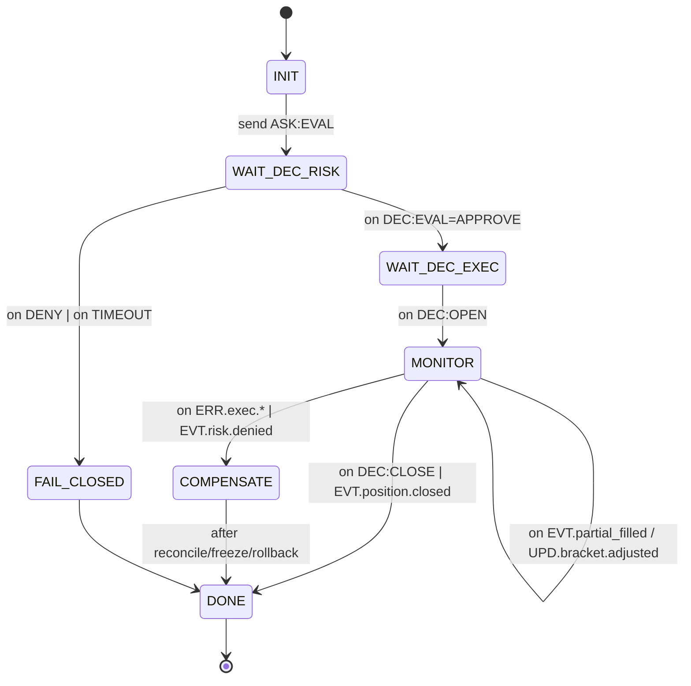

# docs/CENTRAL_FSM_SPEC.md

## 1)                       

                 **                                                          **             FSM:

* **OrchestratorFSM (TRADE Coordinator)**                                              `rid`                               .
* **MetaFSM (Registry/Governance)**                                  ,                  ,                              , freeze/failover.

## 2)                    (                             )

**                        (                               ):** `rid(uuid)`, `span`, `verb`, `domain`, `ttl_profile   {critical,fast,normal,ml_slow,background}`, `policy.idempotent_key`, `why   80`, `why_explain_ref?`, `data_ref?`, `sig?`.

### 2.1 OrchestratorFSM                              

* `ASK:EVAL` (     `risk_strategy`), `DEC:EVAL(APPROVE|DENY)`                                                   .
* `ASK:OPEN|CLOSE` (     `execution_position`), `DEC:OPEN|CLOSE`                                                  .
*                                      : `EVT.position.partial_filled`, `UPD.bracket.adjusted`, `ERR.exec.*`, `EVT.risk.denied`.
*                 : `EVT.orch.timeout`, `EVT.orch.compensate`, `EVT.orch.freeze_position`.

### 2.2 MetaFSM                              

* `EVT.registry.heartbeat` (                     )     `UPD.registry.status` (                 /            ).
* `ERR.registry.schema_mismatch`     `EVT.registry.freeze_domain` (governance freeze).
* `EVT.registry.schema_canary_ok|fail`.

>                       Draft 2020   12; `$id`/`$schema`                        ; additive   only                           .

## 3)                                                     

**                    :**                  Risk = `DENY`;        `ASK/DEC`            `policy.idempotent_key`;                        no   op; out   of   order                                      `DEC:OPEN` (                `rid`).

## 4)               , TTL, CB,             

* **TTL-              :** critical(50    )/fast(200    )/normal(2  )/ml_slow(10  )/background(30  ).
* **Risk   wait             ** = critical;                           `FAIL_CLOSED` + `ERR:TIMEOUT`    WAL.
* **CB (circuit breaker)**                :                           `timeout_rate>1%`        `5xx spike`;                                                 (                                            `ASK`).
* **            **:                     **                          **                  (                  ,              `ASK:EVAL`).

## 5)                                                           

*                                         : `domain:verb:{position_id|clientOrderId|rid}`.
* **              **         -           `ASK/DEC`                                       **no-op**.
* **Out-of-order**:                 `DEC:OPEN`                           ,                                      ;            `DEC:OPEN`                               MONITOR.

## 6)                                            (COMPENSATE)

              : `ERR.exec.rejected`, `EVT.risk.denied`,                            ,                                        .
      : freeze               ,                      peer-              ,                              ,               WAL + panic-bundle,                      Ops.

## 7) XAI    why_chain

*                   `DEC/ERR`                      `why   80` (                       ).
* **why_chain**                           OrchestratorFSM                                  `/debug/{rid}` (                trace).
*                                             `why_explain_ref` (cold   storage),                              p95.

## 8) DR / WAL / Replay

* WAL JSONL append   only, hash               ,                Merkle   root.
* Snapshots                           `wal_range`      `merkle_root`.
* `/replay`                                     1:1; **replay   success**                               SLI.

## 9) Security (Ed25519, RBAC/ABAC, redaction)

* High   risk `DEC/CMD` (OPEN/CLOSE/ADJUST)                              Ed25519;               KMS.
* RBAC/ABAC      `/debug`, promote/rollback, registry freeze.
* Redaction                        /PII              ;                secure   log           .

## 10)                                                

* `/health`     liveness/readiness; `/metrics`     p50/p95/timeout/queue depth;
* `/debug/{rid}`     why_chain + trace + refs; `/replay`                            RID/                  ; `/statdump`                                        /          .

## 11)                                       (            )

**ASK:EVAL (     Risk):**         : `rid, verb=ASK:EVAL, domain=risk_strategy, ttl_profile=critical, signal_code, confidence, context[8..16], metrics{   }, data_ref?, why?`

**DEC:EVAL:**         : `rid, verb=DEC:EVAL, verdict   {APPROVE,DENY}, limits{max_f,max_leverage}? , why, sig`.

**ASK:OPEN (     Exec):**         : `rid, ttl_profile=fast, policy.idempotent_key, order{symbol,side,qty,price_mode,reduce_only?}, why?`.

**EVT.position.partial_filled:**         : `rid, position_id, filled_qty, remaining_qty, price, why, span`.

## 12)                           (                             )

* **Contract**: JSON   Schema                                      verbs; additive   only diffs.
* **Integration**: EVAL   OPEN   MONITOR   CLOSE; duplicates; out   of   order; compensation; freeze.
* **Chaos**:                                   Risk/Exec; CB   trigger; mass duplicate; WAL   corrupt (                    ).
* **Perf (smoke)**: p95(hot)     50     ; router p95     10     .
* **DR**: replay          e2e                    1:1; snapshot rollback         .

## 13) KPI / SLI

Latency per hop; timeout_rate; CB   open%; replay   success%; state   drift%; WHY   coverage%;                    DEC/CMD%; redaction coverage.

## 14)                                          

* **OrchestratorFSM**                                                    ;              RID                                     .
* **MetaFSM**                                                  ;                      , health, governance freeze.

## 15)                                                         (          )

1.                           Orchestrator/MetaFSM    `dictionaries/global_v2_2.yaml`                            `schemas/`.
2.                `/health /metrics /debug /replay`; WAL round   trip.
3.                      `execution_position`            Orchestrator (shadow),                  `risk_strategy`.
4.                    why_chain,                        , CI             .
