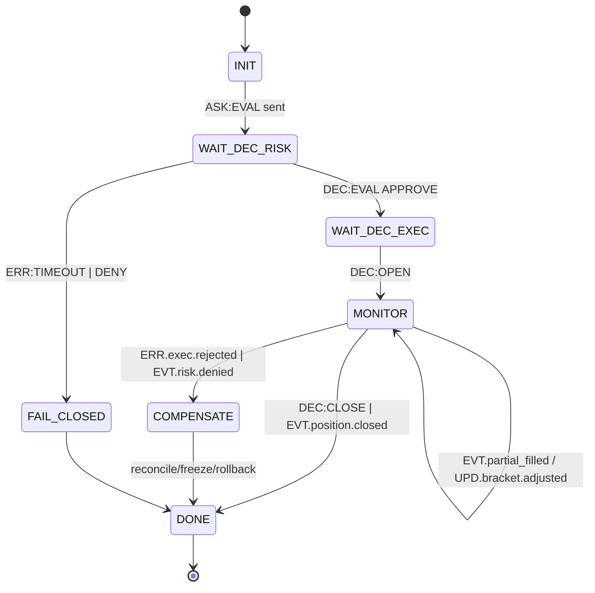

# docs/ROADMAP_DELTA_EMPTY_BRANCH.md

## QuantumTraderX V4.0     vFoundation FSM Federation (Empty-Branch Delta Plan)

### 0)                       

                                                                                                                                                 ,                              vFoundation                                                         FSM                                    (**additive-only**).

**                                   **: contract-first     additive-only     fail-closed     safety-                                                         per `rid`/`policy.idempotent_key`     TTL-                   data-by-reference                    **Ed25519**        high-risk `DEC/CMD`     WORM-audit (WAL hash-chain + daily Merkle)     `/replay`                    1:1.

**SLO**: p95(hot)     50      (                      100     )     state-drift < 1%     WHY-coverage     95%     timeout_rate     1%     coverage(FSM)     90%     RTO     5          RPO     1     .

---

### 1)                                                     (                                            )

                                           : **Risk Dictatorship                            blast-radius                                                          **.

|            |                (          )                                 |                                                                                               |                                       |
| ----: | ----------------------------------------------- | ------------------------------------------------------------------------------------ | -------------------------- |
| **1** | **execution_position** (Order/Position/Bracket) |                                              :                                                              , OCO/TP-SL, partial fills | Router/Contracts,                  |
| **2** | **risk_strategy** (Safety   Sizing)               |         /                                                       -           `OPEN/CLOSE` (                =DENY)                | 1                          |
| **3** | **analyzer/strategy** (Signal/Regime)           |                        `ASK:EVAL` (Signal Encoding v1)                                                         | 1   2                        |
| **4** | **xai_audit**                                   | `/debug/{rid}`, why_chain, panic-bundle                             P2                            | 1   3                        |
| **5** | **data_monitoring** (klines/features/cache)     |                    analyzer/risk;                         by-ref                                         | 3                          |
| **6** | **reward_alysha** (cold-path)                   |                          p95;                                                                                        | 3   5                        |
| **7** | **rl_core** (PPO/LSTM, promote/rollback)        |                         governance;                                                                         | 6                          |

>                                1   4                                                          DR/Obs;                                                       data/learn.

---

### 2)                    FSM                     (v1,                                        )

|                         | FSM-               v1                              |                                                                      |                                                       |
| ------------------ | ------------------------------------------- | --------------------------------------------------------- | --------------------------------------------- |
| execution_position | **3**: OrderFSM, PositionFSM, BracketFSM    |             /                         ;                                               ; OCO/TP-SL | Execution =                                 3 FSM                      |
| risk_strategy      | **2**: SafetyFSM, SizingFSM                 |          (APPROVE/DENY)                                 /                         |                      KPI                                |
| analyzer/strategy  | **2**: SignalFSM, RegimeFSM                 |                                  ;                                                   |                       `ASK:EVAL`                        |
| xai_audit          | **1**: AuditFSM                             | why_chain,           , panic-bundle                            |                                                    |
| data_monitoring    | **2**: StreamSupervisorFSM, FeatureCacheFSM | WS-                  /            ;                                         |                                                                   |
| reward_alysha      | **1**: RewardFSM                            |           /                                (cold)                             |                                                         |
| rl_core            | **3**: TrainFSM, EvalFSM, PromoteFSM        |                     ;                   ;           /                                   |            governance                              |
| **          **          | **14 FSM**                                  |                                                           |               8 FSM (             1   4),                           |

>                                             : execution=2 (Position+Bracket), risk=1 (Safety+Sizing).                                                    (14)                                       -            .

---

### 3)                               (          )     OrchestratorFSM + MetaFSM

* **OrchestratorFSM (TRADE Coordinator)**:                                              `rid`                                (EVAL   OPEN   MONITOR   CLOSE/COMPENSATE),                                                          TTL/CB/idempotency,                **why_chain**,                                      /                  .
* **MetaFSM (Registry/Governance)**:                                    /                     , health/readiness, schema-canary, freeze        mismatch,                       DR `/replay`.

---

### 4)                            -    -               (                                                     )

1. **Contracts First**                    `dictionaries/domain/<system>.yaml`                            `schemas/*.json` (Draft 2020-12), CI: schema-lint + additive-only diff.
2. **ACL-Adapter**                          legacy DTO              ;                  TTL                                    ;                                **Safety** (                           ).
3. **FSM-                **                                       FSM                            ; WHY (   80)                   `DEC/ERR`.
4. **Shadow-mode**     dual-read, zero-write;                         legacy; **state-drift < 1%**.
5. **Canary     Cutover**     single-writer (        /lease), 10   20%     100%; DR: WAL+snapshot+replay     ; rollback-            .
6. **                  /XAI/DR**                     `JOURNAL.md`, ADR                        /                ,                    `docs/Operations.md`, WHY-coverage    95%, panic-bundle.

---

### 5)                         (                                             )

* **            :** coverage(FSM)     90%; contract/consumer-driven                        .
* **                            :** p95(hot)     50     ; timeout_rate     1%;                                     .
* **              :** Ed25519                     high-risk `DEC/CMD`; redaction; RBAC/ABAC.
* **DR:** WAL hash-chain + Merkle; snapshot+replay 1:1.
* **Governance:** additive-only, schema-canary, freeze        mismatch.

---

### 6)             -         (P0   P3)                                 

**P0 (       1   2):**              vFoundation         ;                OrchestratorFSM/MetaFSM (                                + health);                        Global Dictionary;                        schemas; WAL round   trip; CI               .

**P1 (       3   6):**              `execution_position` + ACL + 3 FSM;              `risk_strategy` + 2 FSM;                                  chestrator; **Shadow-mode**.

**Gate P1:** shadow    95%; WHY-coverage    95% (hot 100%); WAL-replay     .

**P2 (       7   10):**              `analyzer/strategy` (Signal/Regime)      `xai_audit`; **Canary 10   20%**, single-writer, monitor p95/timeout.

**Gate P2:** p95(hot)     50     ; state-drift < 1%; timeout     1%; DR-replay     .

**P3 (       11   15):**              `data_monitoring` (2 FSM), `reward_alysha` (1 FSM), `rl_core` (3 FSM,          PromoteFSM            governance);               /            ; PRR       -          .

---

### 7) RACI

|                    |                                                                 |
| -------------- | ----------------------------------------------- |
| Lead Architect |                     ,                        , Go/No-Go              |
| Gemini Agent   |           /        /          , FSM handlers, CI                        |
| Ops/SRE        | CI,               ,             , DR           , panic-bundle     |
| Security       | KMS/keys/Ed25519, RBAC/ABAC, redaction          |
| Quant/Risk     |                    safety/                , chaos-           hot-path |

---

### 8)                      

1.                                  Orchestrator/MetaFSM    `dictionaries/global_v2_2.yaml`;                        `schemas/*`.
2.                                   `execution_position`     ACL     3 FSM     Shadow-mode.
3.                                             `risk_strategy`                                     shadow                         .
4.                    `/debug/{rid}`    why_chain    P1.

---

