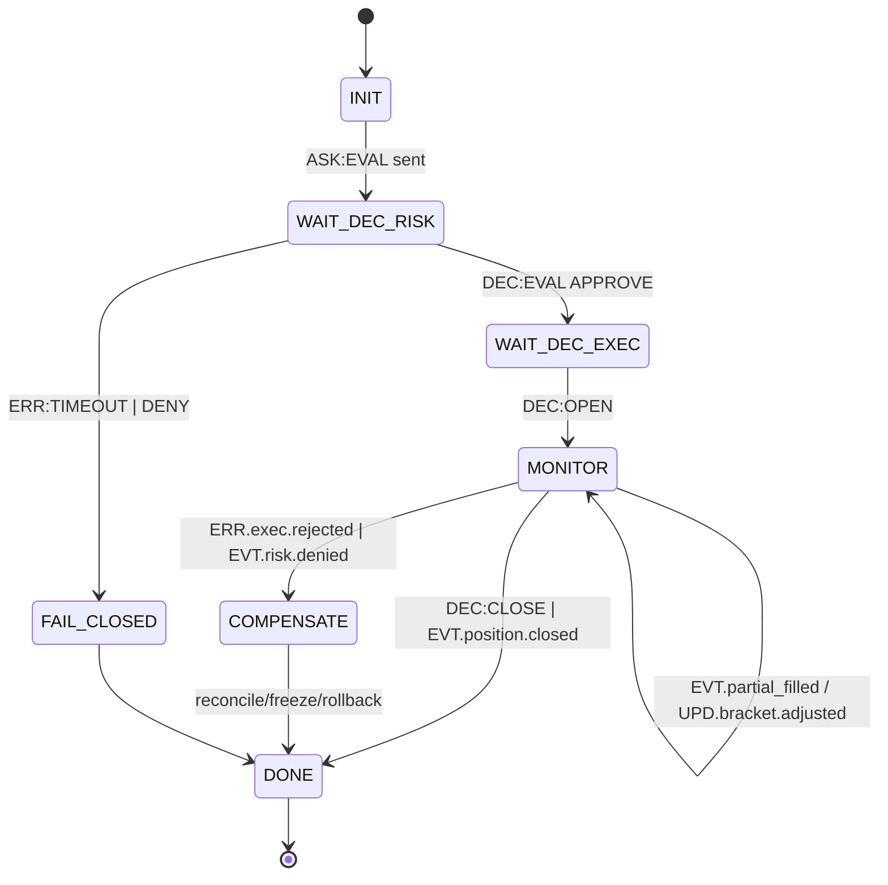

# docs/ROADMAP_DELTA_EMPTY_BRANCH.md

## QuantumTraderX V4.0 ‚Üí vFoundation FSM Federation (Empty-Branch Delta Plan)

### 0) –ú–µ—Ç–∞ –π —É–º–æ–≤–∏

–ú—ñ–≥—Ä–∞—Ü—ñ—è –≤ –Ω–æ–≤—ñ–π –ø–æ—Ä–æ–∂–Ω—ñ–π –≥—ñ–ª—Ü—ñ —à–ª—è—Ö–æ–º –ø–æ–µ—Ç–∞–ø–Ω–æ–≥–æ –≤–∏—Ç—è–≥—É–≤–∞–Ω–Ω—è — –∏— —Ç–µ–º–Ω–∏—Ö –ø–∞–ø–æ–∫, —ó—Ö –æ–±–≥–æ—Ä—Ç–∞–Ω–Ω—è —É vFoundation —ñ –ø—ñ–¥–∫–ª—é—á–µ–Ω–Ω—è –¥–æ —Ñ–µ–¥–µ—Ä–∞—Ç–∏–≤–Ω–æ—ó FSM –±–µ–∑ –ª–∞–º–∞–ª—å–Ω–∏—Ö –∑–º—ñ–Ω (**additive-only**).

**–ö–ª—é—á–æ–≤—ñ —ñ–Ω–≤–∞—Ä—ñ–∞–Ω—Ç–∏**: contract-first ‚Ä¢ additive-only ‚Ä¢ fail-closed ‚Ä¢ safety-–≤–µ—Ç–æ –ø–µ—Ä—à–∏–º ‚Ä¢ —ñ–¥–µ–º–ø–æ—Ç–µ–Ω—Ç–Ω—ñ— —Ç—å per `rid`/`policy.idempotent_key` ‚Ä¢ TTL-–ø—Ä–æ—Ñ—ñ–ª—ñ ‚Ä¢ data-by-reference ‚Ä¢ –ø—ñ–¥–ø–∏— –∏ **Ed25519** –¥–ª—è high-risk `DEC/CMD` ‚Ä¢ WORM-audit (WAL hash-chain + daily Merkle) ‚Ä¢ `/replay` –≤—ñ–¥—Ç–≤–æ—Ä—é—î 1:1.

**SLO**: p95(hot) ‚⧠50 –º—  (–∑–∞–≥–∞–ª—å–Ω–∏–π ‚â§100 –º— ) ‚Ä¢ state-drift < 1% ‚Ä¢ WHY-coverage ‚â• 95% ‚Ä¢ timeout_rate ‚⧠1% ‚Ä¢ coverage(FSM) ‚â• 90% ‚Ä¢ RTO ‚⧠5 —Ö–≤ ‚Ä¢ RPO ‚⧠1 —Ö–≤.

---

### 1) –ü–æ—Ä—è–¥–æ–∫ –ø—ñ–¥‚Äô—î–¥–Ω–∞–Ω–Ω—è — –∏— —Ç–µ–º (–ª–æ–≥—ñ–∫–∞ —Ç–∞ –æ–±“ë—Ä—É–Ω—Ç—É–≤–∞–Ω–Ω—è)

–ö—Ä–∏—Ç–µ—Ä—ñ—ó –ø—Ä—ñ–æ—Ä–∏—Ç–∏–∑–∞—Ü—ñ—ó: **Risk Dictatorship ‚Üí –º—ñ–Ω—ñ–º–∞–ª—å–Ω–∏–π blast-radius ‚Üí –∑–∞–ª–µ–∂–Ω–æ— —Ç—ñ ‚Üí — –ø–æ— —Ç–µ—Ä–µ–∂–Ω—ñ— —Ç—å**.

| –ß–µ—Ä–≥–∞ | –°–∏— —Ç–µ–º–∞ (–¥–æ–º–µ–Ω)                                 | –ß–æ–º—É –∑–∞—Ä–∞–∑                                                                           | –ó–∞–ª–µ–∂–∏—Ç—å –≤—ñ–¥               |
| ----: | ----------------------------------------------- | ------------------------------------------------------------------------------------ | -------------------------- |
| **1** | **execution_position** (Order/Position/Bracket) | –ù–∞–π–±—ñ–ª—å—à–∏–π —Ä–∏–∑–∏–∫ —ñ –µ—Ñ–µ–∫—Ç: –∫–æ–Ω—Ç—Ä–æ–ª—å –∂–∏—Ç—Ç—î–≤–æ–≥–æ —Ü–∏–∫–ª—É –ø–æ–∑–∏—Ü—ñ–π, OCO/TP-SL, partial fills | Router/Contracts, — –ª–æ–≤–Ω–∏–∫–∏ |
| **2** | **risk_strategy** (Safety‚ÜíSizing)               | –í–µ—Ç–æ/— –∞–π–∑–∏–Ω–≥ –º–∞—é—Ç—å –ø–µ—Ä–µ–¥—É–≤–∞—Ç–∏ –±—É–¥—å-—è–∫–æ–º—É `OPEN/CLOSE` (–º–æ–≤—á–∞–Ω–Ω—è=DENY)                | 1                          |
| **3** | **analyzer/strategy** (Signal/Regime)           | –°—Ç–∞–Ω–¥–∞—Ä—Ç–Ω–∏–π `ASK:EVAL` (Signal Encoding v1) — —Ç–∞–±—ñ–ª—ñ–∑—É—î –≤—Ö–æ–¥–∏                         | 1‚Äì2                        |
| **4** | **xai_audit**                                   | `/debug/{rid}`, why_chain, panic-bundle — потрібні від P2                            | 1–3                        |
| **5** | **data_monitoring** (klines/features/cache)     | –ü—ñ–¥–∂–∏–≤–ª—é—î analyzer/risk; –ª–µ–≥–∫–æ –º–æ–∫–∞—Ç–∏ by-ref                                         | 3                          |
| **6** | **reward_alysha** (cold-path)                   | –ù–µ –≤–ø–ª–∏–≤–∞—î –Ω–∞ p95; –ø—ñ–¥‚Äô—î–¥–Ω—É—î—Ç—å— —è –ø–æ–¥—ñ—è–º–∏                                             | 3‚Äì5                        |
| **7** | **rl_core** (PPO/LSTM, promote/rollback)        | –¢—ñ–ª—å–∫–∏ —á–µ—Ä–µ–∑ governance; —Ö–æ–ª–æ–¥–Ω–∏–π —à–ª—è—Ö                                               | 6                          |

> –£–∂–µ –ø—ñ— –ª—è –∫—Ä–æ–∫—ñ–≤ 1‚Äì4 –º–∞—î–º–æ –∫–µ—Ä–æ–≤–∞–Ω–∏–π –≥–∞—Ä—è—á–∏–π —à–ª—è—Ö –∑ DR/Obs; –¥–∞–ª—ñ ‚Äî –±–µ–∑–ø–µ—á–Ω–µ –ø—ñ–¥‚Äô—î–¥–Ω–∞–Ω–Ω—è data/learn.

---

### 2) –ö—ñ–ª—å–∫—ñ— —Ç—å FSM –Ω–∞ — –∏— —Ç–µ–º—É (v1, –º—ñ–Ω—ñ–º–∞–ª—å–Ω–æ –¥–æ— —Ç–∞—Ç–Ω—å–æ)

| –î–æ–º–µ–Ω              | FSM-–æ–¥–∏–Ω–∏—Ü—ñ v1                              | –ü—Ä–∏–∑–Ω–∞—á–µ–Ω–Ω—è                                               | –ü—Ä–∏–º—ñ—Ç–∫–∏                                      |
| ------------------ | ------------------------------------------- | --------------------------------------------------------- | --------------------------------------------- |
| execution_position | **3**: OrderFSM, PositionFSM, BracketFSM    | –û—Ä–¥–µ—Ä–∏/—á–∞— —Ç–∫–æ–≤—ñ —Ñ—ñ–ª–∏; –∞–≥—Ä–µ–≥–æ–≤–∞–Ω–∏–π — —Ç–∞–Ω –ø–æ–∑–∏—Ü—ñ—ó; OCO/TP-SL | Execution = –≥–æ–ª–æ–≤–Ω–∏–π —Ä–∏–∑–∏–∫ ‚Üí 3 FSM –≤–∏–ø—Ä–∞–≤–¥–∞–Ω–æ |
| risk_strategy      | **2**: SafetyFSM, SizingFSM                 | –í–µ—Ç–æ (APPROVE/DENY) —Ç–∞ –æ–∫—Ä–µ–º–æ — –∞–π–∑–∏–Ω–≥/–ø–ª–µ—á–µ               | –†–æ–∑–¥—ñ–ª—è—î–º–æ KPI                                |
| analyzer/strategy  | **2**: SignalFSM, RegimeFSM                 | –ï–Ω–∫–æ–¥–∏–Ω–≥ — –∏–≥–Ω–∞–ª—ñ–≤; —Ä–µ–∂–∏–º–∏ —Ä–∏–Ω–∫—É                           | –ß–∏— —Ç–∏–π –≤—Ö—ñ–¥ `ASK:EVAL`                        |
| xai_audit          | **1**: AuditFSM                             | why_chain, –∞—É–¥–∏—Ç, panic-bundle                            | –õ–µ–≥–∫–∞                                         |
| data_monitoring    | **2**: StreamSupervisorFSM, FeatureCacheFSM | WS-–∫–æ–Ω–µ–∫—à–µ–Ω–∏/—Ä–µ—Ç—Ä–∞—ó; –∫–µ—à                                  | –ö–æ–Ω—Ç—Ä–æ–ª—å — —Ç–∞–±—ñ–ª—å–Ω–æ— —Ç—ñ                         |
| reward_alysha      | **1**: RewardFSM                            | –ó–≤—ñ—Ç–∏/–ø—ñ–¥–∫–∞–∑–∫–∏ –ø–æ–ª—ñ—Ç–∏–∫ (cold)                             | –ê— –∏–Ω—Ö—Ä–æ–Ω–Ω–æ                                    |
| rl_core            | **3**: TrainFSM, EvalFSM, PromoteFSM        | —Ç—Ä–µ–Ω—É–≤–∞–Ω–Ω—è; –≤–∞–ª—ñ–¥–∞—Ü—ñ—è; –ø—Ä–æ–º–æ/—Ä–æ–ª–±–µ–∫                       | –ß–µ—Ä–µ–∑ governance                              |
| **Разом**          | **14 FSM**                                  |                                                           | Почни з 8 FSM (домени 1–4), розширюй          |

> –°–ø—Ä–æ—â–µ–Ω–∞ — —Ç–∞—Ä—Ç–æ–≤–∞ –æ–ø—Ü—ñ—è: execution=2 (Position+Bracket), risk=1 (Safety+Sizing). –†–µ–∫–æ–º–µ–Ω–¥–æ–≤–∞–Ω–æ –±–∞–∑–æ–≤–∏–π –ø–ª–∞–Ω (14) –¥–ª—è –ø—Ä–æ–∑–æ—Ä–æ— —Ç—ñ —Ä–∏–∑–∏–∫-–º–µ—Ç—Ä–∏–∫.

---

### 3) Центральний шар (огляд) — OrchestratorFSM + MetaFSM

* **OrchestratorFSM (TRADE Coordinator)**: –∫–æ–æ—Ä–¥–∏–Ω—É—î –∂–∏—Ç—Ç—î–≤–∏–π —Ü–∏–∫–ª `rid` —É –≥–∞—Ä—è—á–æ–º—É —à–ª—è—Ö—É (EVAL‚ÜíOPEN‚ÜíMONITOR‚ÜíCLOSE/COMPENSATE), –∑–∞— —Ç–æ— –æ–≤—É—î –≥–ª–æ–±–∞–ª—å–Ω—ñ –ø–æ–ª—ñ—Ç–∏–∫–∏ TTL/CB/idempotency, –∞–≥—Ä–µ–≥—É—î **why_chain**, —ñ–Ω—ñ—Ü—ñ—é—î –∫–æ–º–ø–µ–Ω— –∞—Ü—ñ—ó/–∑–∞–º–æ—Ä–æ–∑–∫–∏.
* **MetaFSM (Registry/Governance)**: —Ä–µ—î— —Ç—Ä–∞—Ü—ñ—è –¥–æ–º–µ–Ω—ñ–≤/–≤–µ—Ä— —ñ–π — —Ö–µ–º, health/readiness, schema-canary, freeze –ø—Ä–∏ mismatch, — –ø—ñ–≤–ø—Ä–∞—Ü—è –∑ DR `/replay`.

---

### 4) –ü–ª–µ–π–±—É–∫ ¬´–ø–∞–ø–∫–∞-–∑–∞-–ø–∞–ø–∫–æ—鬪 (–ø–æ–≤—Ç–æ—Ä–Ω–∏–π –¥–ª—è –∫–æ–∂–Ω–æ—ó — –∏— —Ç–µ–º–∏)

1. **Contracts First** ‚Üí –æ–Ω–æ–≤–∏—Ç–∏ `dictionaries/domain/<system>.yaml` ‚Üí –∑–≥–µ–Ω–µ—Ä—É–≤–∞—Ç–∏ `schemas/*.json` (Draft 2020-12), CI: schema-lint + additive-only diff.
2. **ACL-Adapter** ‚Üí –Ω–æ—Ä–º–∞–ª—ñ–∑—É—î legacy DTO —É –ø–æ–¥—ñ—ó; –ø—Ä–∏–º—É—à—É—î TTL —Ç–∞ —ñ–¥–µ–º–ø–æ—Ç–µ–Ω—Ç–Ω—ñ— —Ç—å; —É— —ñ –ø–æ—Ç–æ–∫–∏ —á–µ—Ä–µ–∑ **Safety** (–∂–æ–¥–Ω–∏—Ö –æ–±—Ö–æ–¥—ñ–≤).
3. **FSM-обгортка** → мінімальний набір FSM згідно таблиці; WHY (≤80) у кожному `DEC/ERR`.
4. **Shadow-mode** ‚Üí dual-read, zero-write; –ø–æ—Ä—ñ–≤–Ω—è–Ω–Ω—è –∑ legacy; **state-drift < 1%**.
5. **Canary → Cutover** → single-writer (флаг/lease), 10–20% → 100%; DR: WAL+snapshot+replay ок; rollback-важіль.
6. **–î–æ–∫—É–º–µ–Ω—Ç–∏/XAI/DR** ‚Üí –∑–∞–ø–∏— –∏ —É `JOURNAL.md`, ADR –¥–ª—è –∞–¥–∞–ø—Ç–µ—Ä–∞/–∫–∞—Ç–æ–≤–µ—Ä—É, –æ–Ω–æ–≤–ª–µ–Ω–Ω—è `docs/Operations.md`, WHY-coverage ‚â•95%, panic-bundle.

---

### 5) –ì–µ–π—Ç–∏ —è–∫–æ— —Ç—ñ (–Ω–∞ –∫–æ–∂–Ω–∏–π —ñ–º–ø–æ—Ä—Ç — –∏— —Ç–µ–º–∏)

* **–Ø–∫—ñ— —Ç—å:** coverage(FSM) ‚â• 90%; contract/consumer-driven —Ç–µ— —Ç–∏ –∑–µ–ª–µ–Ω—ñ.
* **–ü—Ä–æ–¥—É–∫—Ç–∏–≤–Ω—ñ— —Ç—å:** p95(hot) ‚⧠50 –º— ; timeout_rate ‚⧠1%; —á–µ—Ä–≥–∞ –ø—ñ–¥ –∫–æ–Ω—Ç—Ä–æ–ª–µ–º.
* **–ë–µ–∑–ø–µ–∫–∞:** Ed25519 –ø—ñ–¥–ø–∏— –∏ –Ω–∞ high-risk `DEC/CMD`; redaction; RBAC/ABAC.
* **DR:** WAL hash-chain + Merkle; snapshot+replay 1:1.
* **Governance:** additive-only, schema-canary, freeze –ø—Ä–∏ mismatch.

---

### 6) –°–ø—Ä–∏–Ω—Ç-–ø–ª–∞–Ω (P0‚ÜíP3) –∑ –ø–æ—Ä–æ–∂–Ω—å–æ—ó –≥—ñ–ª–∫–∏

**P0 (–î–Ω—ñ 1‚Äì2):** —ñ–º–ø–æ—Ä—Ç vFoundation —è–¥—Ä–∞; –ø—ñ–¥–Ω—è—Ç–∏ OrchestratorFSM/MetaFSM (–ø–æ—Ä–æ–∂–Ω—ñ —Ö–µ–Ω–¥–ª–µ—Ä–∏ + health); –∑–∞—Ñ—ñ–∫— —É–≤–∞—Ç–∏ Global Dictionary; –∑–≥–µ–Ω–µ—Ä—É–≤–∞—Ç–∏ schemas; WAL round‚Äëtrip; CI –∑–µ–ª–µ–Ω–∏–π.

**P1 (Дні 3–6):** імпорт `execution_position` + ACL + 3 FSM; імпорт `risk_strategy` + 2 FSM; зв’язати через Орchestrator; **Shadow-mode**.

**Gate P1:** shadow ‚â•95%; WHY-coverage ‚â•95% (hot 100%); WAL-replay –æ–∫.

**P2 (Дні 7–10):** імпорт `analyzer/strategy` (Signal/Regime) та `xai_audit`; **Canary 10–20%**, single-writer, monitor p95/timeout.

**Gate P2:** p95(hot) ‚⧠50 –º— ; state-drift < 1%; timeout ‚⧠1%; DR-replay –æ–∫.

**P3 (–î–Ω—ñ 11‚Äì15):** —ñ–º–ø–æ—Ä—Ç `data_monitoring` (2 FSM), `reward_alysha` (1 FSM), `rl_core` (3 FSM, –ª–∏—à–µ PromoteFSM —á–µ—Ä–µ–∑ governance); –¥–∞—à–±–æ—Ä–¥/–∞–ª–µ—Ä—Ç–∏; PRR —á–µ–∫-–ª–∏— —Ç–∏.

---

### 7) RACI

| –†–æ–ª—å           | –í—ñ–¥–ø–æ–≤—ñ–¥–∞–ª—å–Ω—ñ— —Ç—å                                |
| -------------- | ----------------------------------------------- |
| Lead Architect | –Ü–Ω–≤–∞—Ä—ñ–∞–Ω—Ç–∏, –º–µ–∂—ñ –¥–æ–º–µ–Ω—ñ–≤, Go/No-Go              |
| Gemini Agent   | –°—Ö–µ–º–∏/–º–æ–∫–∏/—Ç–µ— —Ç–∏, FSM handlers, CI —ñ–Ω—Ç–µ–≥—Ä–∞—Ü—ñ—ó   |
| Ops/SRE        | CI, –º–µ—Ç—Ä–∏–∫–∏, –∞–ª–µ—Ä—Ç–∏, DR —Ç–µ— —Ç–∏, panic-bundle     |
| Security       | KMS/keys/Ed25519, RBAC/ABAC, redaction          |
| Quant/Risk     | –ü–∞—Ä–∞–º–µ—Ç—Ä–∏ safety/— –∞–π–∑–∏–Ω–≥—É, chaos-–∫–µ–π— –∏ hot-path |

---

### 8) –ù–µ–≥–∞–π–Ω—ñ –¥—ñ—ó

1. –î–æ–¥–∞—Ç–∏ –∑–∞–ø–∏— –∏ –¥–ª—è Orchestrator/MetaFSM —É `dictionaries/global_v2_2.yaml`; –∑–≥–µ–Ω–µ—Ä—É–≤–∞—Ç–∏ `schemas/*`.
2. –Ü–º–ø–æ—Ä—Ç—É–≤–∞—Ç–∏ –ø–∞–ø–∫—É `execution_position` ‚Üí ACL ‚Üí 3 FSM ‚Üí Shadow-mode.
3. –ü–∞—Ä–∞–ª–µ–ª—å–Ω–æ –ø—ñ–¥–≥–æ—Ç—É–≤–∞—Ç–∏ `risk_strategy` ‚Üí –ø—ñ–¥–∫–ª—é—á–∏—Ç–∏ –ø—ñ— –ª—è shadow‚Äë–≤–µ—Ä–∏—Ñ—ñ–∫–∞—Ü—ñ—ó.
4. –£–≤—ñ–º–∫–Ω—É—Ç–∏ `/debug/{rid}` —ñ why_chain –∑ P1.

---

