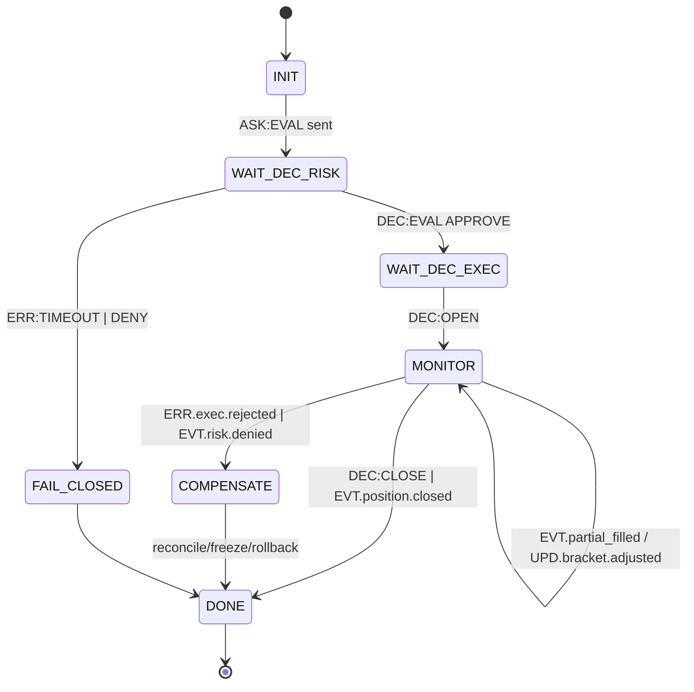

# docs/ROADMAP_DELTA_EMPTY_BRANCH.md

## QuantumTraderX V4.0 ‚Üí vFoundation FSM Federation (Empty-Branch Delta Plan)

### 0)  ú µ Ç    π  É º æ ≤ ∏

 ú ñ ≥     Ü ñ è  ≤  Ω æ ≤ ñ π    æ   æ ∂ Ω ñ π  ≥ ñ ª Ü ñ  à ª è Ö æ º    æ µ Ç     Ω æ ≥ æ  ≤ ∏ Ç è ≥ É ≤   Ω Ω è    ∏   Ç µ º Ω ∏ Ö        æ ∫,  ó Ö  æ ± ≥ æ   Ç   Ω Ω è  É vFoundation  ñ    ñ ¥ ∫ ª é á µ Ω Ω è  ¥ æ  Ñ µ ¥ µ     Ç ∏ ≤ Ω æ ó FSM  ± µ ∑  ª   º   ª å Ω ∏ Ö  ∑ º ñ Ω (**additive-only**).

** ö ª é á æ ≤ ñ  ñ Ω ≤     ñ   Ω Ç ∏**: contract-first ‚ ¢ additive-only ‚ ¢ fail-closed ‚ ¢ safety- ≤ µ Ç æ    µ   à ∏ º ‚ ¢  ñ ¥ µ º   æ Ç µ Ω Ç Ω ñ   Ç å per `rid`/`policy.idempotent_key` ‚ ¢ TTL-     æ Ñ ñ ª ñ ‚ ¢ data-by-reference ‚ ¢    ñ ¥   ∏   ∏ **Ed25519**  ¥ ª è high-risk `DEC/CMD` ‚ ¢ WORM-audit (WAL hash-chain + daily Merkle) ‚ ¢ `/replay`  ≤ ñ ¥ Ç ≤ æ   é î 1:1.

**SLO**: p95(hot) ‚⧠50  º   ( ∑   ≥   ª å Ω ∏ π ‚â§100  º  ) ‚ ¢ state-drift < 1% ‚ ¢ WHY-coverage ‚â• 95% ‚ ¢ timeout_rate ‚⧠1% ‚ ¢ coverage(FSM) ‚â• 90% ‚ ¢ RTO ‚⧠5  Ö ≤ ‚ ¢ RPO ‚⧠1  Ö ≤.

---

### 1)  ü æ   è ¥ æ ∫    ñ ¥‚ ô î ¥ Ω   Ω Ω è    ∏   Ç µ º ( ª æ ≥ ñ ∫    Ç    æ ±“ë   É Ω Ç É ≤   Ω Ω è)

 ö   ∏ Ç µ   ñ ó      ñ æ   ∏ Ç ∏ ∑   Ü ñ ó: **Risk Dictatorship ‚Üí  º ñ Ω ñ º   ª å Ω ∏ π blast-radius ‚Üí  ∑   ª µ ∂ Ω æ   Ç ñ ‚Üí      æ   Ç µ   µ ∂ Ω ñ   Ç å**.

|  ß µ   ≥   |  ° ∏   Ç µ º   ( ¥ æ º µ Ω)                                 |  ß æ º É  ∑       ∑                                                                           |  ó   ª µ ∂ ∏ Ç å  ≤ ñ ¥               |
| ----: | ----------------------------------------------- | ------------------------------------------------------------------------------------ | -------------------------- |
| **1** | **execution_position** (Order/Position/Bracket) |  ù   π ± ñ ª å à ∏ π    ∏ ∑ ∏ ∫  ñ  µ Ñ µ ∫ Ç:  ∫ æ Ω Ç   æ ª å  ∂ ∏ Ç Ç î ≤ æ ≥ æ  Ü ∏ ∫ ª É    æ ∑ ∏ Ü ñ π, OCO/TP-SL, partial fills | Router/Contracts,    ª æ ≤ Ω ∏ ∫ ∏ |
| **2** | **risk_strategy** (Safety‚ÜíSizing)               |  í µ Ç æ/     π ∑ ∏ Ω ≥  º   é Ç å    µ   µ ¥ É ≤   Ç ∏  ± É ¥ å- è ∫ æ º É `OPEN/CLOSE` ( º æ ≤ á   Ω Ω è=DENY)                | 1                          |
| **3** | **analyzer/strategy** (Signal/Regime)           |  ° Ç   Ω ¥     Ç Ω ∏ π `ASK:EVAL` (Signal Encoding v1)    Ç   ± ñ ª ñ ∑ É î  ≤ Ö æ ¥ ∏                         | 1‚ ì2                        |
| **4** | **xai_audit**                                   | `/debug/{rid}`, why_chain, panic-bundle ‚ î    æ Ç   ñ ± Ω ñ  ≤ ñ ¥ P2                            | 1‚ ì3                        |
| **5** | **data_monitoring** (klines/features/cache)     |  ü ñ ¥ ∂ ∏ ≤ ª é î analyzer/risk;  ª µ ≥ ∫ æ  º æ ∫   Ç ∏ by-ref                                         | 3                          |
| **6** | **reward_alysha** (cold-path)                   |  ù µ  ≤   ª ∏ ≤   î  Ω   p95;    ñ ¥‚ ô î ¥ Ω É î Ç å   è    æ ¥ ñ è º ∏                                             | 3‚ ì5                        |
| **7** | **rl_core** (PPO/LSTM, promote/rollback)        |  ¢ ñ ª å ∫ ∏  á µ   µ ∑ governance;  Ö æ ª æ ¥ Ω ∏ π  à ª è Ö                                               | 6                          |

>  £ ∂ µ    ñ   ª è  ∫   æ ∫ ñ ≤ 1‚ ì4  º   î º æ  ∫ µ   æ ≤   Ω ∏ π  ≥     è á ∏ π  à ª è Ö  ∑ DR/Obs;  ¥   ª ñ ‚ î  ± µ ∑   µ á Ω µ    ñ ¥‚ ô î ¥ Ω   Ω Ω è data/learn.

---

### 2)  ö ñ ª å ∫ ñ   Ç å FSM  Ω      ∏   Ç µ º É (v1,  º ñ Ω ñ º   ª å Ω æ  ¥ æ   Ç   Ç Ω å æ)

|  î æ º µ Ω              | FSM- æ ¥ ∏ Ω ∏ Ü ñ v1                              |  ü   ∏ ∑ Ω   á µ Ω Ω è                                               |  ü   ∏ º ñ Ç ∫ ∏                                      |
| ------------------ | ------------------------------------------- | --------------------------------------------------------- | --------------------------------------------- |
| execution_position | **3**: OrderFSM, PositionFSM, BracketFSM    |  û   ¥ µ   ∏/ á     Ç ∫ æ ≤ ñ  Ñ ñ ª ∏;    ≥   µ ≥ æ ≤   Ω ∏ π    Ç   Ω    æ ∑ ∏ Ü ñ ó; OCO/TP-SL | Execution =  ≥ æ ª æ ≤ Ω ∏ π    ∏ ∑ ∏ ∫ ‚Üí 3 FSM  ≤ ∏       ≤ ¥   Ω æ |
| risk_strategy      | **2**: SafetyFSM, SizingFSM                 |  í µ Ç æ (APPROVE/DENY)  Ç    æ ∫   µ º æ      π ∑ ∏ Ω ≥/   ª µ á µ               |  † æ ∑ ¥ ñ ª è î º æ KPI                                |
| analyzer/strategy  | **2**: SignalFSM, RegimeFSM                 |  ï Ω ∫ æ ¥ ∏ Ω ≥    ∏ ≥ Ω   ª ñ ≤;    µ ∂ ∏ º ∏    ∏ Ω ∫ É                           |  ß ∏   Ç ∏ π  ≤ Ö ñ ¥ `ASK:EVAL`                        |
| xai_audit          | **1**: AuditFSM                             | why_chain,    É ¥ ∏ Ç, panic-bundle                            |  õ µ ≥ ∫                                           |
| data_monitoring    | **2**: StreamSupervisorFSM, FeatureCacheFSM | WS- ∫ æ Ω µ ∫ à µ Ω ∏/   µ Ç     ó;  ∫ µ à                                  |  ö æ Ω Ç   æ ª å    Ç   ± ñ ª å Ω æ   Ç ñ                         |
| reward_alysha      | **1**: RewardFSM                            |  ó ≤ ñ Ç ∏/   ñ ¥ ∫   ∑ ∫ ∏    æ ª ñ Ç ∏ ∫ (cold)                             |  ê   ∏ Ω Ö   æ Ω Ω æ                                    |
| rl_core            | **3**: TrainFSM, EvalFSM, PromoteFSM        |  Ç   µ Ω É ≤   Ω Ω è;  ≤   ª ñ ¥   Ü ñ è;      æ º æ/   æ ª ± µ ∫                       |  ß µ   µ ∑ governance                              |
| ** †   ∑ æ º**          | **14 FSM**                                  |                                                           |  ü æ á Ω ∏  ∑ 8 FSM ( ¥ æ º µ Ω ∏ 1‚ ì4),    æ ∑ à ∏   é π          |

>  °     æ â µ Ω      Ç     Ç æ ≤    æ   Ü ñ è: execution=2 (Position+Bracket), risk=1 (Safety+Sizing).  † µ ∫ æ º µ Ω ¥ æ ≤   Ω æ  ±   ∑ æ ≤ ∏ π    ª   Ω (14)  ¥ ª è      æ ∑ æ   æ   Ç ñ    ∏ ∑ ∏ ∫- º µ Ç   ∏ ∫.

---

### 3)  ¶ µ Ω Ç     ª å Ω ∏ π  à     ( æ ≥ ª è ¥) ‚ î OrchestratorFSM + MetaFSM

* **OrchestratorFSM (TRADE Coordinator)**:  ∫ æ æ   ¥ ∏ Ω É î  ∂ ∏ Ç Ç î ≤ ∏ π  Ü ∏ ∫ ª `rid`  É  ≥     è á æ º É  à ª è Ö É (EVAL‚ÜíOPEN‚ÜíMONITOR‚ÜíCLOSE/COMPENSATE),  ∑     Ç æ   æ ≤ É î  ≥ ª æ ±   ª å Ω ñ    æ ª ñ Ç ∏ ∫ ∏ TTL/CB/idempotency,    ≥   µ ≥ É î **why_chain**,  ñ Ω ñ Ü ñ é î  ∫ æ º   µ Ω     Ü ñ ó/ ∑   º æ   æ ∑ ∫ ∏.
* **MetaFSM (Registry/Governance)**:    µ î   Ç     Ü ñ è  ¥ æ º µ Ω ñ ≤/ ≤ µ     ñ π    Ö µ º, health/readiness, schema-canary, freeze      ∏ mismatch,      ñ ≤       Ü è  ∑ DR `/replay`.

---

### 4)  ü ª µ π ± É ∫ ¬´       ∫  - ∑  -       ∫ æ 鬪 (   æ ≤ Ç æ   Ω ∏ π  ¥ ª è  ∫ æ ∂ Ω æ ó    ∏   Ç µ º ∏)

1. **Contracts First** ‚Üí  æ Ω æ ≤ ∏ Ç ∏ `dictionaries/domain/<system>.yaml` ‚Üí  ∑ ≥ µ Ω µ   É ≤   Ç ∏ `schemas/*.json` (Draft 2020-12), CI: schema-lint + additive-only diff.
2. **ACL-Adapter** ‚Üí  Ω æ   º   ª ñ ∑ É î legacy DTO  É    æ ¥ ñ ó;      ∏ º É à É î TTL  Ç    ñ ¥ µ º   æ Ç µ Ω Ç Ω ñ   Ç å;  É   ñ    æ Ç æ ∫ ∏  á µ   µ ∑ **Safety** ( ∂ æ ¥ Ω ∏ Ö  æ ± Ö æ ¥ ñ ≤).
3. **FSM- æ ± ≥ æ   Ç ∫  ** ‚Üí  º ñ Ω ñ º   ª å Ω ∏ π  Ω   ± ñ   FSM  ∑ ≥ ñ ¥ Ω æ  Ç   ± ª ∏ Ü ñ; WHY (‚â§80)  É  ∫ æ ∂ Ω æ º É `DEC/ERR`.
4. **Shadow-mode** ‚Üí dual-read, zero-write;    æ   ñ ≤ Ω è Ω Ω è  ∑ legacy; **state-drift < 1%**.
5. **Canary ‚Üí Cutover** ‚Üí single-writer ( Ñ ª   ≥/lease), 10‚ ì20% ‚Üí 100%; DR: WAL+snapshot+replay  æ ∫; rollback- ≤   ∂ ñ ª å.
6. ** î æ ∫ É º µ Ω Ç ∏/XAI/DR** ‚Üí  ∑     ∏   ∏  É `JOURNAL.md`, ADR  ¥ ª è    ¥     Ç µ    / ∫   Ç æ ≤ µ   É,  æ Ω æ ≤ ª µ Ω Ω è `docs/Operations.md`, WHY-coverage ‚â•95%, panic-bundle.

---

### 5)  ì µ π Ç ∏  è ∫ æ   Ç ñ ( Ω    ∫ æ ∂ Ω ∏ π  ñ º   æ   Ç    ∏   Ç µ º ∏)

* ** Ø ∫ ñ   Ç å:** coverage(FSM) ‚â• 90%; contract/consumer-driven  Ç µ   Ç ∏  ∑ µ ª µ Ω ñ.
* ** ü   æ ¥ É ∫ Ç ∏ ≤ Ω ñ   Ç å:** p95(hot) ‚⧠50  º  ; timeout_rate ‚⧠1%;  á µ   ≥      ñ ¥  ∫ æ Ω Ç   æ ª µ º.
* ** ë µ ∑   µ ∫  :** Ed25519    ñ ¥   ∏   ∏  Ω   high-risk `DEC/CMD`; redaction; RBAC/ABAC.
* **DR:** WAL hash-chain + Merkle; snapshot+replay 1:1.
* **Governance:** additive-only, schema-canary, freeze      ∏ mismatch.

---

### 6)  °     ∏ Ω Ç-   ª   Ω (P0‚ÜíP3)  ∑    æ   æ ∂ Ω å æ ó  ≥ ñ ª ∫ ∏

**P0 ( î Ω ñ 1‚ ì2):**  ñ º   æ   Ç vFoundation  è ¥    ;    ñ ¥ Ω è Ç ∏ OrchestratorFSM/MetaFSM (   æ   æ ∂ Ω ñ  Ö µ Ω ¥ ª µ   ∏ + health);  ∑   Ñ ñ ∫   É ≤   Ç ∏ Global Dictionary;  ∑ ≥ µ Ω µ   É ≤   Ç ∏ schemas; WAL round‚ ëtrip; CI  ∑ µ ª µ Ω ∏ π.

**P1 ( î Ω ñ 3‚ ì6):**  ñ º   æ   Ç `execution_position` + ACL + 3 FSM;  ñ º   æ   Ç `risk_strategy` + 2 FSM;  ∑ ≤‚ ô è ∑   Ç ∏  á µ   µ ∑  û  chestrator; **Shadow-mode**.

**Gate P1:** shadow ‚â•95%; WHY-coverage ‚â•95% (hot 100%); WAL-replay  æ ∫.

**P2 ( î Ω ñ 7‚ ì10):**  ñ º   æ   Ç `analyzer/strategy` (Signal/Regime)  Ç   `xai_audit`; **Canary 10‚ ì20%**, single-writer, monitor p95/timeout.

**Gate P2:** p95(hot) ‚⧠50  º  ; state-drift < 1%; timeout ‚⧠1%; DR-replay  æ ∫.

**P3 ( î Ω ñ 11‚ ì15):**  ñ º   æ   Ç `data_monitoring` (2 FSM), `reward_alysha` (1 FSM), `rl_core` (3 FSM,  ª ∏ à µ PromoteFSM  á µ   µ ∑ governance);  ¥   à ± æ   ¥/   ª µ   Ç ∏; PRR  á µ ∫- ª ∏   Ç ∏.

---

### 7) RACI

|  † æ ª å           |  í ñ ¥   æ ≤ ñ ¥   ª å Ω ñ   Ç å                                |
| -------------- | ----------------------------------------------- |
| Lead Architect |  Ü Ω ≤     ñ   Ω Ç ∏,  º µ ∂ ñ  ¥ æ º µ Ω ñ ≤, Go/No-Go              |
| Gemini Agent   |  ° Ö µ º ∏/ º æ ∫ ∏/ Ç µ   Ç ∏, FSM handlers, CI  ñ Ω Ç µ ≥     Ü ñ ó   |
| Ops/SRE        | CI,  º µ Ç   ∏ ∫ ∏,    ª µ   Ç ∏, DR  Ç µ   Ç ∏, panic-bundle     |
| Security       | KMS/keys/Ed25519, RBAC/ABAC, redaction          |
| Quant/Risk     |  ü       º µ Ç   ∏ safety/     π ∑ ∏ Ω ≥ É, chaos- ∫ µ π   ∏ hot-path |

---

### 8)  ù µ ≥   π Ω ñ  ¥ ñ ó

1.  î æ ¥   Ç ∏  ∑     ∏   ∏  ¥ ª è Orchestrator/MetaFSM  É `dictionaries/global_v2_2.yaml`;  ∑ ≥ µ Ω µ   É ≤   Ç ∏ `schemas/*`.
2.  Ü º   æ   Ç É ≤   Ç ∏        ∫ É `execution_position` ‚Üí ACL ‚Üí 3 FSM ‚Üí Shadow-mode.
3.  ü       ª µ ª å Ω æ    ñ ¥ ≥ æ Ç É ≤   Ç ∏ `risk_strategy` ‚Üí    ñ ¥ ∫ ª é á ∏ Ç ∏    ñ   ª è shadow‚ ë ≤ µ   ∏ Ñ ñ ∫   Ü ñ ó.
4.  £ ≤ ñ º ∫ Ω É Ç ∏ `/debug/{rid}`  ñ why_chain  ∑ P1.

---

