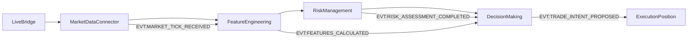

# Features Pipeline Audit Report

##  í µ Ç ∫  : Test_MyPC ( ∫ æ º º ñ Ç: 52c5bfb)

##  ö     Ç      æ Ç æ ∫  

##  ¢   ± ª ∏ Ü è  ≤ É ∑ ª ñ ≤

|  £ ∑ µ ª        |  §   π ª  |  ö ª      / § É Ω ∫ Ü ∏ ∏ |  ° ª É à   µ Ç |  ≠ º ∏ Ç ∏ Ç |  ö ª é á.    æ ª è |
| ----------- | ----- | ------------- | ------- | ------ | ---------- |
| Live Bridge | `apps/reference/domains/market_data/market_data_connector.py` | MarketDataConnector._poll_loop(), _fetch_and_emit_data() | binance REST API | EVT:MARKET_TICK_RECEIVED | `symbol, bid/ask, bid_size/ask_size, buy_volume/sell_volume, ts` |
| MarketData | `apps/reference/domains/market_data/market_data_connector.py` | MarketDataConnector._emit_market_tick() | live feed from BinanceAdapter | `EVT:MARKET_TICK_RECEIVED` | `symbol, price, bid/ask, bid_size/ask_size, buy_volume/sell_volume, ts` |
| Features | `apps/reference/domains/feature_engineering/feature_engineering.py` | FeatureEngineering.on_market_tick(), _calculate_and_emit_features() | `EVT:MARKET_TICK_RECEIVED` | `EVT:FEATURES_CALCULATED` | `obi, tfi, delta_price, absorption, price, ts` |
| Risk | `apps/reference/domains/risk_management/risk_management.py` | RiskManagement.on_features_calculated(), _calculate_risk_parameters() | `EVT:FEATURES_CALCULATED`, `EVT:PORTFOLIO_STATE_UPDATED` | `EVT:RISK_ASSESSMENT_COMPLETED` | `is_trading_allowed, risk_score` |
| Decision | `apps/reference/domains/decision_making/decision_making.py` | DecisionMaking.on_features(), on_risk(), _make_decision_for_symbol() | `features+risk+portfolio` | `EVT:TRADE_INTENT_PROPOSED` | `symbol, side, qty, price_ref, order` |

##  ü   ∏ á ∏ Ω ∏ `features=False`  É      æ µ ∫ Ç ñ

 ó    Ω   ª ñ ∑ É  ∫ æ ¥ É DecisionMaking, `features=False`  ≤ ∏ Ω ∏ ∫   î  ∫ æ ª ∏:

1. ** ù µ º   î EVT:FEATURES_CALCULATED**  ¥ ª è    ∏ º ≤ æ ª   - DecisionMaking  á µ ∫   î  Ω   `on_features()`  ≤ ∏ ∫ ª ∏ ∫
2. ** ù µ º   î EVT:RISK_ASSESSMENT_COMPLETED**  ¥ ª è    ∏ º ≤ æ ª   -  á µ ∫   î  Ω   `on_risk()`  ≤ ∏ ∫ ª ∏ ∫
3. ** ù µ º   î PORTFOLIO_STATE_UPDATED** -  á µ ∫   î  Ω   `on_portfolio()`  ≤ ∏ ∫ ª ∏ ∫
4. **TTL/ É   Ç     µ ≤   Ω ∏ µ** -  Ω µ º   î  è ≤ Ω æ ó  ª æ ≥ ñ ∫ ∏ TTL,    ª µ  ¥   Ω ñ  º æ ∂ É Ç å  ± É Ç ∏  ∑     Ç     ñ ª ∏ º ∏
5. ** ù µ       ≤ ∏ ª å Ω ñ    ñ ¥   ∏   ∫ ∏** -  ¥ æ º µ Ω ∏    µ î   Ç   É é Ç å   è  ≤ main.py,    ª µ  è ∫ â æ FSM  Ω µ  ñ Ω ñ Ü ñ   ª ñ ∑ æ ≤   Ω ∏ π        ≤ ∏ ª å Ω æ,    æ ¥ ñ ó  Ω µ  ¥ æ Ö æ ¥ è Ç å
6. ** ö æ Ω Ñ ñ ≥ É     Ü ñ è    ∏ º ≤ æ ª ñ ≤** - MarketDataConnector  º   î `symbols_to_track: ["BTCUSDT", "ETHUSDT"]`, DecisionMaking        Ü é î  ∑  Ç ∏ º ∏      º ∏ º ∏    ∏ º ≤ æ ª   º ∏

##  °   ∏   æ ∫  Ç æ á Ω ∏ Ö  Ñ É Ω ∫ Ü ñ π/   Ç   æ ∫  ∫ æ ¥  

### Live Bridge (MarketDataConnector)
- `apps/reference/domains/market_data/market_data_connector.py:125` - `_poll_loop()`
- `apps/reference/domains/market_data/market_data_connector.py:130` - `_fetch_and_emit_data()`
- `apps/reference/domains/market_data/market_data_connector.py:200` - `_emit_market_tick()`

### MarketDataConnector
- `apps/reference/domains/market_data/market_data_connector.py:200` - `_emit_market_tick()`
- `apps/reference/domains/market_data/market_data_connector.py:35` - `__init__()` -  ñ Ω ñ Ü ñ   ª ñ ∑   Ü ñ è

### FeatureEngineering
- `apps/reference/domains/feature_engineering/feature_engineering.py:15` - `on_market_tick()`
- `apps/reference/domains/feature_engineering/feature_engineering.py:25` - `_calculate_and_emit_features()`
- `apps/reference/domains/feature_engineering/feature_engineering.py:10` - `__init__()` -    ñ ¥   ∏   ∫    Ω      æ ¥ ñ ó

### RiskManagement
- `apps/reference/domains/risk_management/risk_management.py:45` - `on_features_calculated()`
- `apps/reference/domains/risk_management/risk_management.py:75` - `_calculate_risk_parameters()`
- `apps/reference/domains/risk_management/risk_management.py:25` - `__init__()` -    ñ ¥   ∏   ∫    Ω      æ ¥ ñ ó

### DecisionMaking
- `apps/reference/domains/decision_making/decision_making.py:150` - `on_features()`
- `apps/reference/domains/decision_making/decision_making.py:160` - `on_risk()`
- `apps/reference/domains/decision_making/decision_making.py:170` - `on_portfolio()`
- `apps/reference/domains/decision_making/decision_making.py:185` - `_check_and_trigger_decision_for_symbol()`
- `apps/reference/domains/decision_making/decision_making.py:200` - `_make_decision_for_symbol()`
- `apps/reference/domains/decision_making/decision_making.py:90` - `__init__()` -    ñ ¥   ∏   ∫    Ω      æ ¥ ñ ó

##  ú ñ Ω ñ-     æ ≥ æ Ω  Ç         ∏   æ ≤ ∫ ∏

 î ª è    µ   µ ≤ ñ   ∫ ∏    æ Ç æ ∫ É    æ Ç   ñ ± Ω æ:

1.  ó     É   Ç ∏ Ç ∏    ∏   Ç µ º É  ∑ live    µ ∂ ∏ º æ º
2.  ü µ   µ ≤ ñ   ∏ Ç ∏  ª æ ≥ ∏ `logs/domain_decision_making.log`  Ω      æ è ≤ É `on_features()`
3.  ü µ   µ ≤ ñ   ∏ Ç ∏ `aurora_events.jsonl`  Ω   `EVT:FEATURES_CALCULATED`
4.  Ø ∫ â æ    æ ¥ ñ ó  ¥ æ Ö æ ¥ è Ç å,    ª µ `features=False` -    µ   µ ≤ ñ   ∏ Ç ∏    Ç   Ω `symbol_states`  ≤ DecisionMaking

##  í ∏   Ω æ ≤ ∫ ∏

- ** ö     Ç      æ Ç æ ∫    Ç æ á Ω  ** -  ≤   ñ  ≤ É ∑ ª ∏  ∑ Ω   π ¥ µ Ω ñ  Ç        æ   Ω   ª ñ ∑ æ ≤   Ω ñ
- ** ü   ∏ á ∏ Ω ∏ `features=False`** -    µ   µ ≤   ∂ Ω æ  ≤ ñ ¥   É Ç Ω ñ   Ç å    æ ¥ ñ π  ≤ ñ ¥ upstream  ¥ æ º µ Ω ñ ≤
- ** í É ∑ å ∫ ñ  º ñ   Ü è** -  ∫ æ Ω Ñ ñ ≥ É     Ü ñ è    ∏ º ≤ æ ª ñ ≤  É ∑ ≥ æ ¥ ∂ µ Ω  ,    ª µ    æ Ç   ñ ± Ω      µ   µ ≤ ñ   ∫    ñ Ω ñ Ü ñ   ª ñ ∑   Ü ñ ó FSM  Ç      µ î   Ç     Ü ñ ó    ª É Ö   á ñ ≤
- ** † µ ∫ æ º µ Ω ¥   Ü ñ ó** -  ¥ æ ¥   Ç ∏  ± ñ ª å à µ  ª æ ≥ É ≤   Ω Ω è  ≤ MarketDataConnector  Ç      µ   µ ≤ ñ   ∏ Ç ∏ WebSocket aggregator</content>
<parameter name="filePath">c:\Users\user\Music\Phenix\reports\features_pipeline_audit.md
