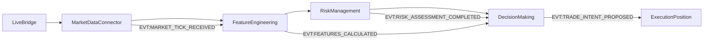

# Features Pipeline Audit Report

## –í–µ—Ç–∫–∞: Test_MyPC (–∫–æ–º–º—ñ—Ç: 52c5bfb)

## –ö–∞—Ä—Ç–∞ –ø–æ—Ç–æ–∫–∞

## –¢–∞–±–ª–∏—Ü—è –≤—É–∑–ª—ñ–≤

| –£–∑–µ–ª        | –§–∞–π–ª  | –ö–ª–∞— — /–§—É–Ω–∫—Ü–∏–∏ | –°–ª—É—à–∞–µ—Ç | –≠–º–∏—Ç–∏—Ç | –ö–ª—é—á. –ø–æ–ª—è |
| ----------- | ----- | ------------- | ------- | ------ | ---------- |
| Live Bridge | `apps/reference/domains/market_data/market_data_connector.py` | MarketDataConnector._poll_loop(), _fetch_and_emit_data() | binance REST API | EVT:MARKET_TICK_RECEIVED | `symbol, bid/ask, bid_size/ask_size, buy_volume/sell_volume, ts` |
| MarketData | `apps/reference/domains/market_data/market_data_connector.py` | MarketDataConnector._emit_market_tick() | live feed from BinanceAdapter | `EVT:MARKET_TICK_RECEIVED` | `symbol, price, bid/ask, bid_size/ask_size, buy_volume/sell_volume, ts` |
| Features | `apps/reference/domains/feature_engineering/feature_engineering.py` | FeatureEngineering.on_market_tick(), _calculate_and_emit_features() | `EVT:MARKET_TICK_RECEIVED` | `EVT:FEATURES_CALCULATED` | `obi, tfi, delta_price, absorption, price, ts` |
| Risk | `apps/reference/domains/risk_management/risk_management.py` | RiskManagement.on_features_calculated(), _calculate_risk_parameters() | `EVT:FEATURES_CALCULATED`, `EVT:PORTFOLIO_STATE_UPDATED` | `EVT:RISK_ASSESSMENT_COMPLETED` | `is_trading_allowed, risk_score` |
| Decision | `apps/reference/domains/decision_making/decision_making.py` | DecisionMaking.on_features(), on_risk(), _make_decision_for_symbol() | `features+risk+portfolio` | `EVT:TRADE_INTENT_PROPOSED` | `symbol, side, qty, price_ref, order` |

## –ü—Ä–∏—á–∏–Ω–∏ `features=False` —É –ø—Ä–æ–µ–∫—Ç—ñ

–ó –∞–Ω–∞–ª—ñ–∑—É –∫–æ–¥—É DecisionMaking, `features=False` –≤–∏–Ω–∏–∫–∞—î –∫–æ–ª–∏:

1. **–ù–µ–º–∞—î EVT:FEATURES_CALCULATED** –¥–ª—è — –∏–º–≤–æ–ª–∞ - DecisionMaking —á–µ–∫–∞—î –Ω–∞ `on_features()` –≤–∏–∫–ª–∏–∫
2. **–ù–µ–º–∞—î EVT:RISK_ASSESSMENT_COMPLETED** –¥–ª—è — –∏–º–≤–æ–ª–∞ - —á–µ–∫–∞—î –Ω–∞ `on_risk()` –≤–∏–∫–ª–∏–∫
3. **–ù–µ–º–∞—î PORTFOLIO_STATE_UPDATED** - —á–µ–∫–∞—î –Ω–∞ `on_portfolio()` –≤–∏–∫–ª–∏–∫
4. **TTL/—É— —Ç–∞—Ä–µ–≤–∞–Ω–∏–µ** - –Ω–µ–º–∞—î —è–≤–Ω–æ—ó –ª–æ–≥—ñ–∫–∏ TTL, –∞–ª–µ –¥–∞–Ω—ñ –º–æ–∂—É—Ç—å –±—É—Ç–∏ –∑–∞— —Ç–∞—Ä—ñ–ª–∏–º–∏
5. **–ù–µ–ø—Ä–∞–≤–∏–ª—å–Ω—ñ –ø—ñ–¥–ø–∏— –∫–∏** - –¥–æ–º–µ–Ω–∏ —Ä–µ—î— —Ç—Ä—É—é—Ç—å— —è –≤ main.py, –∞–ª–µ —è–∫—â–æ FSM –Ω–µ —ñ–Ω—ñ—Ü—ñ–∞–ª—ñ–∑–æ–≤–∞–Ω–∏–π –ø—Ä–∞–≤–∏–ª—å–Ω–æ, –ø–æ–¥—ñ—ó –Ω–µ –¥–æ—Ö–æ–¥—è—Ç—å
6. **–ö–æ–Ω—Ñ—ñ–≥—É—Ä–∞—Ü—ñ—è — –∏–º–≤–æ–ª—ñ–≤** - MarketDataConnector –º–∞—î `symbols_to_track: ["BTCUSDT", "ETHUSDT"]`, DecisionMaking –ø—Ä–∞—Ü—é—î –∑ —Ç–∏–º–∏ — –∞–º–∏–º–∏ — –∏–º–≤–æ–ª–∞–º–∏

## –°–ø–∏— –æ–∫ —Ç–æ—á–Ω–∏—Ö —Ñ—É–Ω–∫—Ü—ñ–π/— —Ç—Ä–æ–∫ –∫–æ–¥–∞

### Live Bridge (MarketDataConnector)
- `apps/reference/domains/market_data/market_data_connector.py:125` - `_poll_loop()`
- `apps/reference/domains/market_data/market_data_connector.py:130` - `_fetch_and_emit_data()`
- `apps/reference/domains/market_data/market_data_connector.py:200` - `_emit_market_tick()`

### MarketDataConnector
- `apps/reference/domains/market_data/market_data_connector.py:200` - `_emit_market_tick()`
- `apps/reference/domains/market_data/market_data_connector.py:35` - `__init__()` - —ñ–Ω—ñ—Ü—ñ–∞–ª—ñ–∑–∞—Ü—ñ—è

### FeatureEngineering
- `apps/reference/domains/feature_engineering/feature_engineering.py:15` - `on_market_tick()`
- `apps/reference/domains/feature_engineering/feature_engineering.py:25` - `_calculate_and_emit_features()`
- `apps/reference/domains/feature_engineering/feature_engineering.py:10` - `__init__()` - –ø—ñ–¥–ø–∏— –∫–∞ –Ω–∞ –ø–æ–¥—ñ—ó

### RiskManagement
- `apps/reference/domains/risk_management/risk_management.py:45` - `on_features_calculated()`
- `apps/reference/domains/risk_management/risk_management.py:75` - `_calculate_risk_parameters()`
- `apps/reference/domains/risk_management/risk_management.py:25` - `__init__()` - –ø—ñ–¥–ø–∏— –∫–∞ –Ω–∞ –ø–æ–¥—ñ—ó

### DecisionMaking
- `apps/reference/domains/decision_making/decision_making.py:150` - `on_features()`
- `apps/reference/domains/decision_making/decision_making.py:160` - `on_risk()`
- `apps/reference/domains/decision_making/decision_making.py:170` - `on_portfolio()`
- `apps/reference/domains/decision_making/decision_making.py:185` - `_check_and_trigger_decision_for_symbol()`
- `apps/reference/domains/decision_making/decision_making.py:200` - `_make_decision_for_symbol()`
- `apps/reference/domains/decision_making/decision_making.py:90` - `__init__()` - –ø—ñ–¥–ø–∏— –∫–∞ –Ω–∞ –ø–æ–¥—ñ—ó

## –ú—ñ–Ω—ñ-–ø—Ä–æ–≥–æ–Ω —Ç—Ä–∞— — –∏—Ä–æ–≤–∫–∏

–î–ª—è –ø–µ—Ä–µ–≤—ñ—Ä–∫–∏ –ø–æ—Ç–æ–∫—É –ø–æ—Ç—Ä—ñ–±–Ω–æ:

1. –ó–∞–ø—É— —Ç–∏—Ç–∏ — –∏— —Ç–µ–º—É –∑ live —Ä–µ–∂–∏–º–æ–º
2. –ü–µ—Ä–µ–≤—ñ—Ä–∏—Ç–∏ –ª–æ–≥–∏ `logs/domain_decision_making.log` –Ω–∞ –ø–æ—è–≤—É `on_features()`
3. –ü–µ—Ä–µ–≤—ñ—Ä–∏—Ç–∏ `aurora_events.jsonl` –Ω–∞ `EVT:FEATURES_CALCULATED`
4. –Ø–∫—â–æ –ø–æ–¥—ñ—ó –¥–æ—Ö–æ–¥—è—Ç—å, –∞–ª–µ `features=False` - –ø–µ—Ä–µ–≤—ñ—Ä–∏—Ç–∏ — —Ç–∞–Ω `symbol_states` –≤ DecisionMaking

## –í–∏— –Ω–æ–≤–∫–∏

- **–ö–∞—Ä—Ç–∞ –ø–æ—Ç–æ–∫–∞ —Ç–æ—á–Ω–∞** - –≤— —ñ –≤—É–∑–ª–∏ –∑–Ω–∞–π–¥–µ–Ω—ñ —Ç–∞ –ø—Ä–æ–∞–Ω–∞–ª—ñ–∑–æ–≤–∞–Ω—ñ
- **–ü—Ä–∏—á–∏–Ω–∏ `features=False`** - –ø–µ—Ä–µ–≤–∞–∂–Ω–æ –≤—ñ–¥— —É—Ç–Ω—ñ— —Ç—å –ø–æ–¥—ñ–π –≤—ñ–¥ upstream –¥–æ–º–µ–Ω—ñ–≤
- **–í—É–∑—å–∫—ñ –º—ñ— —Ü—è** - –∫–æ–Ω—Ñ—ñ–≥—É—Ä–∞—Ü—ñ—è — –∏–º–≤–æ–ª—ñ–≤ —É–∑–≥–æ–¥–∂–µ–Ω–∞, –∞–ª–µ –ø–æ—Ç—Ä—ñ–±–Ω–∞ –ø–µ—Ä–µ–≤—ñ—Ä–∫–∞ —ñ–Ω—ñ—Ü—ñ–∞–ª—ñ–∑–∞—Ü—ñ—ó FSM —Ç–∞ —Ä–µ—î— —Ç—Ä–∞—Ü—ñ—ó — –ª—É—Ö–∞—á—ñ–≤
- **–†–µ–∫–æ–º–µ–Ω–¥–∞—Ü—ñ—ó** - –¥–æ–¥–∞—Ç–∏ –±—ñ–ª—å—à–µ –ª–æ–≥—É–≤–∞–Ω–Ω—è –≤ MarketDataConnector —Ç–∞ –ø–µ—Ä–µ–≤—ñ—Ä–∏—Ç–∏ WebSocket aggregator</content>
<parameter name="filePath">c:\Users\user\Music\Phenix\reports\features_pipeline_audit.md
