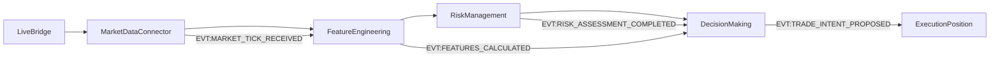

# Features Pipeline Audit Report

##           : Test_MyPC (            : 52c5bfb)

##                        

##                            

|                 |           |           /               |                |              |         .          |
| ----------- | ----- | ------------- | ------- | ------ | ---------- |
| Live Bridge | `apps/reference/domains/market_data/market_data_connector.py` | MarketDataConnector._poll_loop(), _fetch_and_emit_data() | binance REST API | EVT:MARKET_TICK_RECEIVED | `symbol, bid/ask, bid_size/ask_size, buy_volume/sell_volume, ts` |
| MarketData | `apps/reference/domains/market_data/market_data_connector.py` | MarketDataConnector._emit_market_tick() | live feed from BinanceAdapter | `EVT:MARKET_TICK_RECEIVED` | `symbol, price, bid/ask, bid_size/ask_size, buy_volume/sell_volume, ts` |
| Features | `apps/reference/domains/feature_engineering/feature_engineering.py` | FeatureEngineering.on_market_tick(), _calculate_and_emit_features() | `EVT:MARKET_TICK_RECEIVED` | `EVT:FEATURES_CALCULATED` | `obi, tfi, delta_price, absorption, price, ts` |
| Risk | `apps/reference/domains/risk_management/risk_management.py` | RiskManagement.on_features_calculated(), _calculate_risk_parameters() | `EVT:FEATURES_CALCULATED`, `EVT:PORTFOLIO_STATE_UPDATED` | `EVT:RISK_ASSESSMENT_COMPLETED` | `is_trading_allowed, risk_score` |
| Decision | `apps/reference/domains/decision_making/decision_making.py` | DecisionMaking.on_features(), on_risk(), _make_decision_for_symbol() | `features+risk+portfolio` | `EVT:TRADE_INTENT_PROPOSED` | `symbol, side, qty, price_ref, order` |

##                `features=False`                  

                           DecisionMaking, `features=False`                        :

1. **           EVT:FEATURES_CALCULATED**                       - DecisionMaking                 `on_features()`             
2. **           EVT:RISK_ASSESSMENT_COMPLETED**                       -                 `on_risk()`             
3. **           PORTFOLIO_STATE_UPDATED** -                 `on_portfolio()`             
4. **TTL/                      ** -                                    TTL,                                                             
5. **                                       ** -                                          main.py,                 FSM                                                       ,                                 
6. **                                         ** - MarketDataConnector        `symbols_to_track: ["BTCUSDT", "ETHUSDT"]`, DecisionMaking                                                         

##                                         /                   

### Live Bridge (MarketDataConnector)
- `apps/reference/domains/market_data/market_data_connector.py:125` - `_poll_loop()`
- `apps/reference/domains/market_data/market_data_connector.py:130` - `_fetch_and_emit_data()`
- `apps/reference/domains/market_data/market_data_connector.py:200` - `_emit_market_tick()`

### MarketDataConnector
- `apps/reference/domains/market_data/market_data_connector.py:200` - `_emit_market_tick()`
- `apps/reference/domains/market_data/market_data_connector.py:35` - `__init__()` -                           

### FeatureEngineering
- `apps/reference/domains/feature_engineering/feature_engineering.py:15` - `on_market_tick()`
- `apps/reference/domains/feature_engineering/feature_engineering.py:25` - `_calculate_and_emit_features()`
- `apps/reference/domains/feature_engineering/feature_engineering.py:10` - `__init__()` -                                 

### RiskManagement
- `apps/reference/domains/risk_management/risk_management.py:45` - `on_features_calculated()`
- `apps/reference/domains/risk_management/risk_management.py:75` - `_calculate_risk_parameters()`
- `apps/reference/domains/risk_management/risk_management.py:25` - `__init__()` -                                 

### DecisionMaking
- `apps/reference/domains/decision_making/decision_making.py:150` - `on_features()`
- `apps/reference/domains/decision_making/decision_making.py:160` - `on_risk()`
- `apps/reference/domains/decision_making/decision_making.py:170` - `on_portfolio()`
- `apps/reference/domains/decision_making/decision_making.py:185` - `_check_and_trigger_decision_for_symbol()`
- `apps/reference/domains/decision_making/decision_making.py:200` - `_make_decision_for_symbol()`
- `apps/reference/domains/decision_making/decision_making.py:90` - `__init__()` -                                 

##         -                                   

                                                       :

1.                                      live               
2.                               `logs/domain_decision_making.log`                 `on_features()`
3.                      `aurora_events.jsonl`      `EVT:FEATURES_CALCULATED`
4.                                     ,        `features=False` -                               `symbol_states`    DecisionMaking

##                 

- **                                  ** -                                                                     
- **               `features=False`** -                                                             upstream               
- **                       ** -                                                             ,                                                                       FSM                                           
- **                        ** -                                                 MarketDataConnector                           WebSocket aggregator</content>
<parameter name="filePath">c:\Users\user\Music\Phenix\reports\features_pipeline_audit.md
