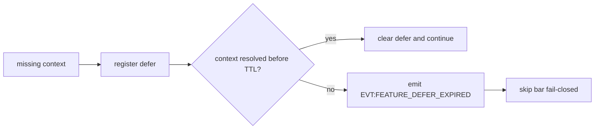

# MD_AMR V1.1 Phase Artifacts

## Phase 1 Required Field Map

| required_field | source | fail action |
|---|---|---|
| `bar.ohlc` | `CMD:PROCESS_STRATEGY.bar` | `DEFER` -> `EVT:FEATURE_DEFER_EXPIRED` |
| `channel_state` | `MDAMRStrategyV11.compute_avg_ohlc_channel` | `DEFER` |
| `atr` | `MDAMRStrategyV11.compute_atr` | `DEFER` |
| `atr_stats` | rolling ATR MA/STD in strategy state | `DEFER` |
| `dir_score` | multi-TF dir components in strategy state | `DEFER` |
| `trace` | strategy signal payload | `REJECT` (`WAL_TRACE_INVALID`) |

## Defer Lifecycle

## New Reason Codes

- `WAL_TRACE_INVALID`
- `FEATURE_DEFER_EXPIRED`
- `MISSING_FEATURE_CONTEXT_MD_AMR`
- `EDGE_GONE_KILLSWITCH`
- `ZOMBIE_POSITION_TIMEOUT`
- `FEE_AWARE_SCALEOUT`
- `LLM_MACRO_BLOCK`

## Phase 2 Formula Sheet

- `atr_zscore = (atr_current - atr_ma_n) / atr_std_n`
- `bias = alpha * abs(dir_score)`
- Trend UP:
  - `thr_buy = thr_base - bias`
  - `thr_sell = thr_base + bias`
- Trend DOWN:
  - `thr_buy = thr_base + bias`
  - `thr_sell = thr_base - bias`
- Dampening trigger:
  - if `atr_zscore > threshold_z` -> `w_d1` and `w_h1` multiplied by `volatility_dampening_factor`

## Phase 3 Contract Matrix

| condition | action | reason_code |
|---|---|---|
| md_amr trace missing/invalid | reject | `WAL_TRACE_INVALID` |
| md_amr intent `FULL_CLOSE` with no position | reject | `NO_POSITION_FOR_CLOSE` |
| md_amr intent `PARTIAL_CLOSE` with invalid fraction | reject | `WAL_TRACE_INVALID` |
| md_amr defer TTL expired | event + skip | `FEATURE_DEFER_EXPIRED` |
| strategy assigned but config missing | fail-fast startup | config contract violation |

## Phase 4 Objective Sheet

- Hard fail:
  - if `max_dd > MAX_DD_LIMIT` or `total_trades < MIN_TRADES` -> `-999.0`
- Core metric:
  - `calmar_ratio = net_profit / max_dd`
- Significance bonus:
  - `statistical_weight = log(total_trades / MIN_TRADES + 1)`
- Final:
  - `objective = calmar_ratio * statistical_weight`
