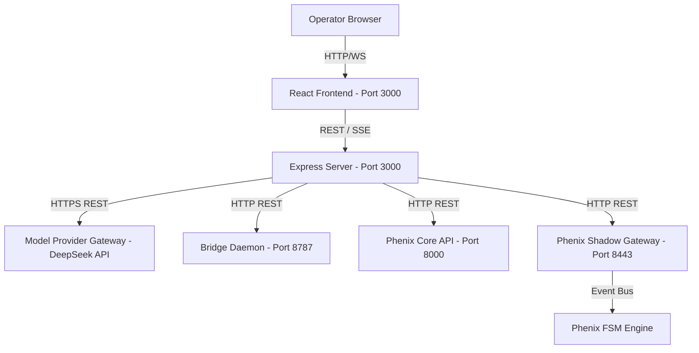

# 03 DeepSeek Agent OS (DSOS) Runtime Chain

This report maps the callable/data-flow path for DSOS.

## 1. Callable Data-Flow Map

## 2. Segment Analysis

### Segment A: Operator Browser → Frontend
- **Source File**: `src/main.tsx` / `src/App.tsx`
- **Protocol / Port**: HTTP / WebSockets (Vite HMR) on `http://localhost:3000`
- **Configuration Source**: Hardcoded in server launch.
- **Evidence Strength**: **HIGHEST** (Verified by local runtime probe).

### Segment B: Frontend → Local Server
- **Source File**: `src/client/*` / fetch calls inside components.
- **Protocol / Port**: REST (JSON) and Server-Sent Events (SSE) `/api/events/stream`.
- **Configuration Source**: Relies on browser host or Vite proxy definitions.
- **Evidence Strength**: **HIGHEST** (Verified by local runtime probe).

### Segment C: Local Server → Model Provider
- **Source File**: `src/agent/providers/adapters/DeepSeekAdapter.ts` / `ProviderGateway.ts`
- **Protocol / Port**: HTTPS REST (Port 443) targeting `https://api.deepseek.com/v1`
- **Configuration Source**: `.env` -> `DEEPSEEK_BASE_URL` & `DEEPSEEK_API_KEY`.
- **Evidence Strength**: **HIGH** (Static code verified).

### Segment D: Local Server → Bridge
- **Source File**: `src/bridge-daemon/client/BridgeCommandClient.ts`
- **Protocol / Port**: HTTP REST (Port 8787) targeting `http://127.0.0.1:8787`
- **Configuration Source**: `.env` -> `LOCAL_WORKSPACE_BRIDGE_URL` & `LOCAL_WORKSPACE_BRIDGE_TOKEN`.
- **Evidence Strength**: **HIGH** (Static code verified).

### Segment E: Local Server → Phenix Core/Shadow APIs
- **Source File**: `src/server/trading/PhenixApiClient.ts` (`submitOpenIntent`, `closePosition`, `amendBrackets`)
- **Protocol / Port**: HTTP REST on ports `8000` and `8443`
- **Configuration Source**: `.env` -> `PHENIX_CORE_API_URL` & `PHENIX_SHADOW_API_URL`.
- **Evidence Strength**: **HIGH** (Static code verified).

### Segment F: Phenix Shadow API → FSM
- **Source File**: `apps/reference/adapters/*` or `vfoundation/*`
- **Protocol / Port**: Local HTTP / Event Bus communication inside the Phenix container.
- **Evidence Strength**: **HIGH** (Verified by FSM execution traces).
